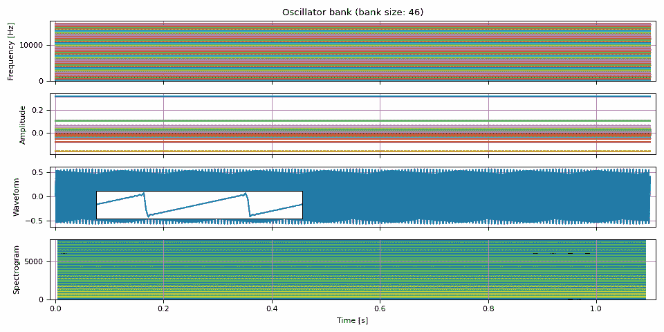
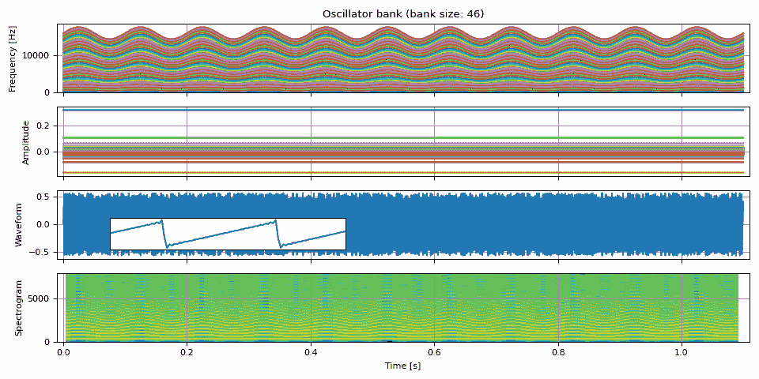
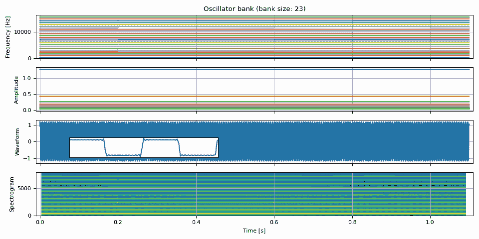
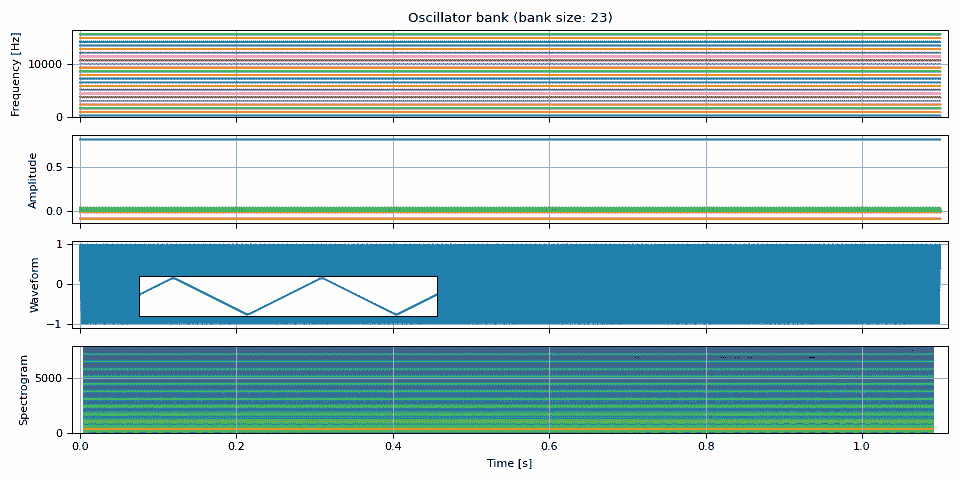
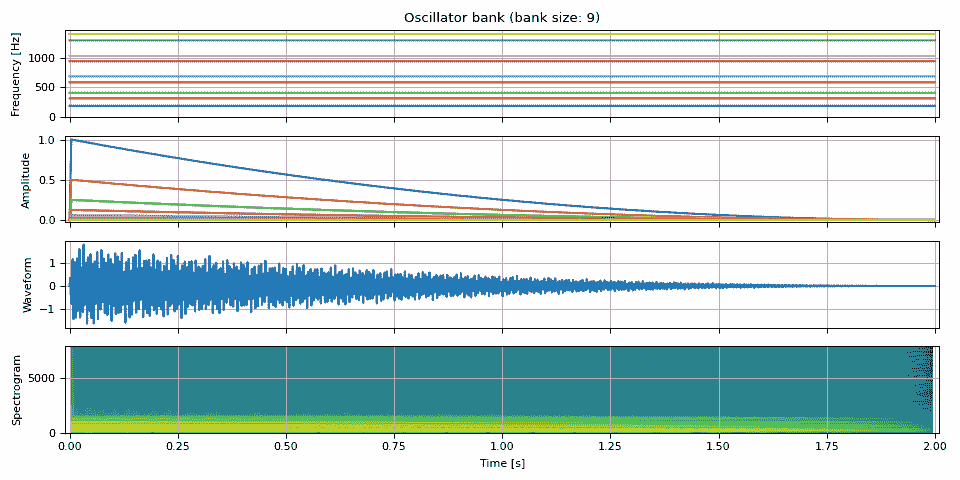
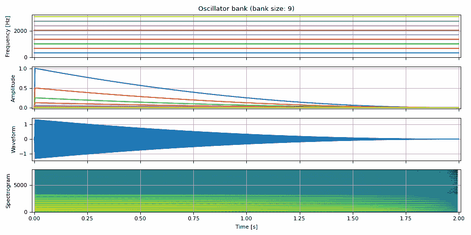

# 加法合成

> 原文：[`pytorch.org/audio/stable/tutorials/additive_synthesis_tutorial.html`](https://pytorch.org/audio/stable/tutorials/additive_synthesis_tutorial.html)
>
> 译者：[飞龙](https://github.com/wizardforcel)
>
> 协议：[CC BY-NC-SA 4.0](http://creativecommons.org/licenses/by-nc-sa/4.0/)


注意

点击这里下载完整示例代码

**作者**: Moto Hira

本教程是振荡器和 ADSR 包络的延续。

本教程展示了如何使用 TorchAudio 的 DSP 函数执行加法合成和减法合成。

加法合成通过组合多个波形创建音色。减法合成通过应用滤波器创建音色。

警告

本教程需要原型 DSP 功能，这些功能在夜间构建中可用。

请参考[`pytorch.org/get-started/locally`](https://pytorch.org/get-started/locally) 获取安装夜间构建的说明。

```py
import torch
import torchaudio

print(torch.__version__)
print(torchaudio.__version__) 
```

```py
2.2.0
2.2.0 
```

## 概述

```py
try:
    from torchaudio.prototype.functional import adsr_envelope, extend_pitch, oscillator_bank
except ModuleNotFoundError:
    print(
        "Failed to import prototype DSP features. "
        "Please install torchaudio nightly builds. "
        "Please refer to https://pytorch.org/get-started/locally "
        "for instructions to install a nightly build."
    )
    raise

import matplotlib.pyplot as plt
from IPython.display import Audio 
```

## 创建多个频率音高

加法合成的核心是振荡器。我们通过将振荡器生成的多个波形相加来创建音色。

在振荡器教程中，我们使用`oscillator_bank()` 和 `adsr_envelope()` 生成各种波形。

在本教程中，我们使用`extend_pitch()` 从基频创建音色。

首先，我们定义一些在整个教程中使用的常量和辅助函数。

```py
PI = torch.pi
PI2 = 2 * torch.pi

F0 = 344.0  # fundamental frequency
DURATION = 1.1  # [seconds]
SAMPLE_RATE = 16_000  # [Hz]

NUM_FRAMES = int(DURATION * SAMPLE_RATE) 
```

```py
def plot(freq, amp, waveform, sample_rate, zoom=None, vol=0.1):
    t = (torch.arange(waveform.size(0)) / sample_rate).numpy()

    fig, axes = plt.subplots(4, 1, sharex=True)
    axes[0].plot(t, freq.numpy())
    axes[0].set(title=f"Oscillator bank (bank size: {amp.size(-1)})", ylabel="Frequency [Hz]", ylim=[-0.03, None])
    axes[1].plot(t, amp.numpy())
    axes[1].set(ylabel="Amplitude", ylim=[-0.03 if torch.all(amp >= 0.0) else None, None])
    axes[2].plot(t, waveform)
    axes[2].set(ylabel="Waveform")
    axes[3].specgram(waveform, Fs=sample_rate)
    axes[3].set(ylabel="Spectrogram", xlabel="Time [s]", xlim=[-0.01, t[-1] + 0.01])

    for i in range(4):
        axes[i].grid(True)
    pos = axes[2].get_position()
    fig.tight_layout()

    if zoom is not None:
        ax = fig.add_axes([pos.x0 + 0.02, pos.y0 + 0.03, pos.width / 2.5, pos.height / 2.0])
        ax.plot(t, waveform)
        ax.set(xlim=zoom, xticks=[], yticks=[])

    waveform /= waveform.abs().max()
    return Audio(vol * waveform, rate=sample_rate, normalize=False) 
```

## 谐波

谐波是基频的整数倍频率成分。

我们将看看如何生成合成器中使用的常见波形。也就是说，

> +   锯齿波
> +   
> +   方波
> +   
> +   三角波

### 锯齿波

[锯齿波](https://en.wikipedia.org/wiki/Sawtooth_wave) 可以表示为以下形式。它包含所有整数谐波，因此在减法合成中常被使用。

$$\begin{align*} y_t &= \sum_{k=1}^{K} A_k \sin ( 2 \pi f_k t ) \\ \text{其中} \\ f_k &= k f_0 \\ A_k &= -\frac{ (-1) ^k }{k \pi} \end{align*}$$

以下函数接受基频和振幅，并根据上述公式添加扩展音高。

```py
def sawtooth_wave(freq0, amp0, num_pitches, sample_rate):
    freq = extend_pitch(freq0, num_pitches)

    mults = [-((-1) ** i) / (PI * i) for i in range(1, 1 + num_pitches)]
    amp = extend_pitch(amp0, mults)
    waveform = oscillator_bank(freq, amp, sample_rate=sample_rate)
    return freq, amp, waveform 
```

现在合成一个波形

```py
freq0 = torch.full((NUM_FRAMES, 1), F0)
amp0 = torch.ones((NUM_FRAMES, 1))
freq, amp, waveform = sawtooth_wave(freq0, amp0, int(SAMPLE_RATE / F0), SAMPLE_RATE)
plot(freq, amp, waveform, SAMPLE_RATE, zoom=(1 / F0, 3 / F0)) 
```



```py
/pytorch/audio/src/torchaudio/prototype/functional/_dsp.py:63: UserWarning: Some frequencies are above nyquist frequency. Setting the corresponding amplitude to zero. This might cause numerically unstable gradient.
  warnings.warn( 
```

您的浏览器不支持音频元素。

可以振荡基频以基于锯齿波创建时变音调。

```py
fm = 10  # rate at which the frequency oscillates [Hz]
f_dev = 0.1 * F0  # the degree of frequency oscillation [Hz]

phase = torch.linspace(0, fm * PI2 * DURATION, NUM_FRAMES)
freq0 = F0 + f_dev * torch.sin(phase).unsqueeze(-1)

freq, amp, waveform = sawtooth_wave(freq0, amp0, int(SAMPLE_RATE / F0), SAMPLE_RATE)
plot(freq, amp, waveform, SAMPLE_RATE, zoom=(1 / F0, 3 / F0)) 
```



```py
/pytorch/audio/src/torchaudio/prototype/functional/_dsp.py:63: UserWarning: Some frequencies are above nyquist frequency. Setting the corresponding amplitude to zero. This might cause numerically unstable gradient.
  warnings.warn( 
```

您的浏览器不支持音频元素。

### 方波

[方波](https://en.wikipedia.org/wiki/Square_wave) 仅包含奇整数谐波。

$$\begin{align*} y_t &= \sum_{k=0}^{K-1} A_k \sin ( 2 \pi f_k t ) \\ \text{其中} \\ f_k &= n f_0 \\ A_k &= \frac{ 4 }{n \pi} \\ n &= 2k + 1 \end{align*}$$

```py
def square_wave(freq0, amp0, num_pitches, sample_rate):
    mults = [2.0 * i + 1.0 for i in range(num_pitches)]
    freq = extend_pitch(freq0, mults)

    mults = [4 / (PI * (2.0 * i + 1.0)) for i in range(num_pitches)]
    amp = extend_pitch(amp0, mults)

    waveform = oscillator_bank(freq, amp, sample_rate=sample_rate)
    return freq, amp, waveform 
```

```py
freq0 = torch.full((NUM_FRAMES, 1), F0)
amp0 = torch.ones((NUM_FRAMES, 1))
freq, amp, waveform = square_wave(freq0, amp0, int(SAMPLE_RATE / F0 / 2), SAMPLE_RATE)
plot(freq, amp, waveform, SAMPLE_RATE, zoom=(1 / F0, 3 / F0)) 
```



```py
/pytorch/audio/src/torchaudio/prototype/functional/_dsp.py:63: UserWarning: Some frequencies are above nyquist frequency. Setting the corresponding amplitude to zero. This might cause numerically unstable gradient.
  warnings.warn( 
```

您的浏览器不支持音频元素。

### 三角波

[三角波](https://en.wikipedia.org/wiki/Triangle_wave) 也仅包含奇整数谐波。

$$\begin{align*} y_t &= \sum_{k=0}^{K-1} A_k \sin ( 2 \pi f_k t ) \\ \text{其中} \\ f_k &= n f_0 \\ A_k &= (-1) ^ k \frac{8}{(n\pi) ^ 2} \\ n &= 2k + 1 \end{align*}$$

```py
def triangle_wave(freq0, amp0, num_pitches, sample_rate):
    mults = [2.0 * i + 1.0 for i in range(num_pitches)]
    freq = extend_pitch(freq0, mults)

    c = 8 / (PI**2)
    mults = [c * ((-1) ** i) / ((2.0 * i + 1.0) ** 2) for i in range(num_pitches)]
    amp = extend_pitch(amp0, mults)

    waveform = oscillator_bank(freq, amp, sample_rate=sample_rate)
    return freq, amp, waveform 
```

```py
freq, amp, waveform = triangle_wave(freq0, amp0, int(SAMPLE_RATE / F0 / 2), SAMPLE_RATE)
plot(freq, amp, waveform, SAMPLE_RATE, zoom=(1 / F0, 3 / F0)) 
```



```py
/pytorch/audio/src/torchaudio/prototype/functional/_dsp.py:63: UserWarning: Some frequencies are above nyquist frequency. Setting the corresponding amplitude to zero. This might cause numerically unstable gradient.
  warnings.warn( 
```

您的浏览器不支持音频元素。

## 非谐波部分

非谐波部分指的是不是基频的整数倍的频率。

它们对于重新创建逼真的声音或使合成结果更有趣至关重要。

### 钟声

[`computermusicresource.com/Simple.bell.tutorial.html`](https://computermusicresource.com/Simple.bell.tutorial.html)

```py
num_tones = 9
duration = 2.0
num_frames = int(SAMPLE_RATE * duration)

freq0 = torch.full((num_frames, 1), F0)
mults = [0.56, 0.92, 1.19, 1.71, 2, 2.74, 3.0, 3.76, 4.07]
freq = extend_pitch(freq0, mults)

amp = adsr_envelope(
    num_frames=num_frames,
    attack=0.002,
    decay=0.998,
    sustain=0.0,
    release=0.0,
    n_decay=2,
)
amp = torch.stack([amp * (0.5**i) for i in range(num_tones)], dim=-1)

waveform = oscillator_bank(freq, amp, sample_rate=SAMPLE_RATE)

plot(freq, amp, waveform, SAMPLE_RATE, vol=0.4) 
```



您的浏览器不支持音频元素。

作为对比，以下是上述内容的谐波版本。只有频率值不同。泛音的数量和幅度相同。

```py
freq = extend_pitch(freq0, num_tones)
waveform = oscillator_bank(freq, amp, sample_rate=SAMPLE_RATE)

plot(freq, amp, waveform, SAMPLE_RATE) 
```



您的浏览器不支持音频元素。

## 参考资料

+   [`en.wikipedia.org/wiki/Additive_synthesis`](https://en.wikipedia.org/wiki/Additive_synthesis)

+   [`computermusicresource.com/Simple.bell.tutorial.html`](https://computermusicresource.com/Simple.bell.tutorial.html)

+   [`computermusicresource.com/Definitions/additive.synthesis.html`](https://computermusicresource.com/Definitions/additive.synthesis.html)

**脚本的总运行时间：**（0 分钟 4.662 秒）

`Download Python source code: additive_synthesis_tutorial.py`

`Download Jupyter 笔记本：additive_synthesis_tutorial.ipynb`

[Sphinx-Gallery 生成的画廊](https://sphinx-gallery.github.io)
