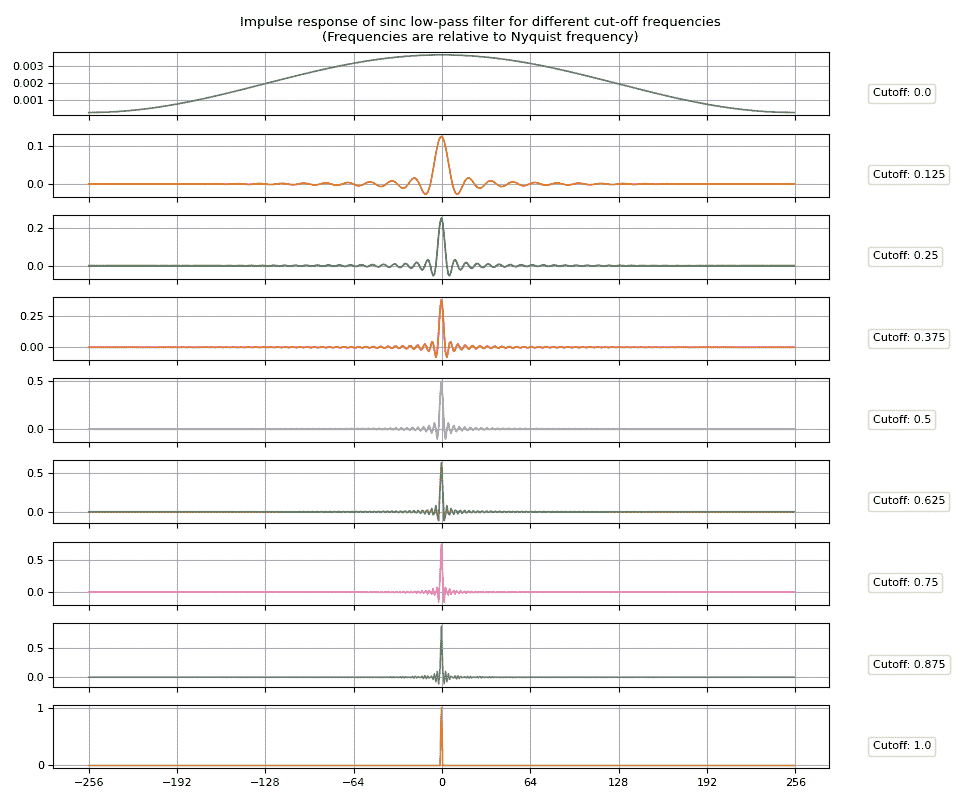
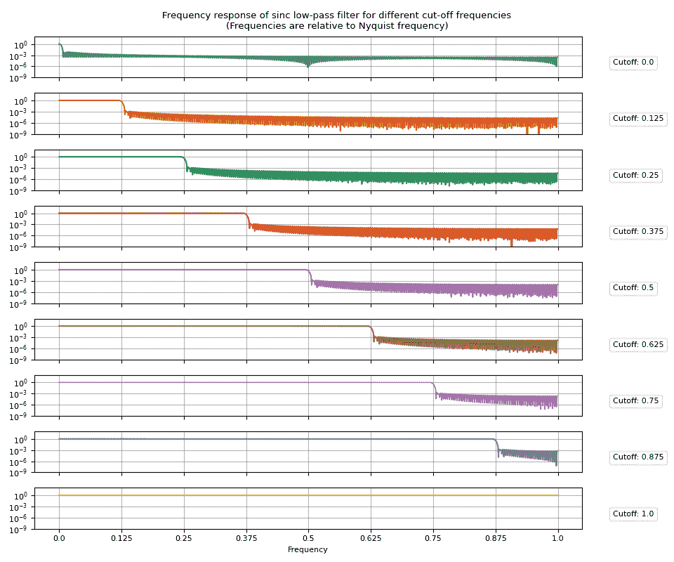
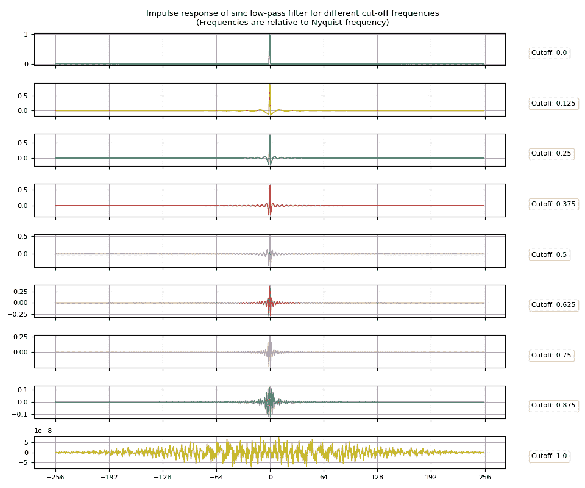
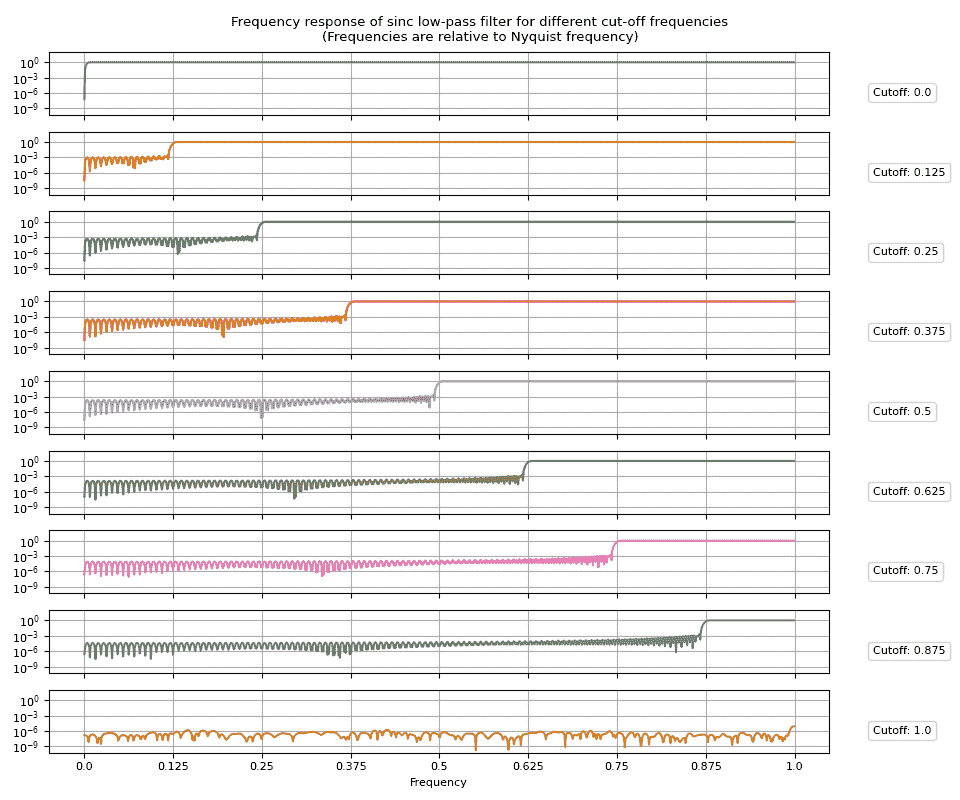
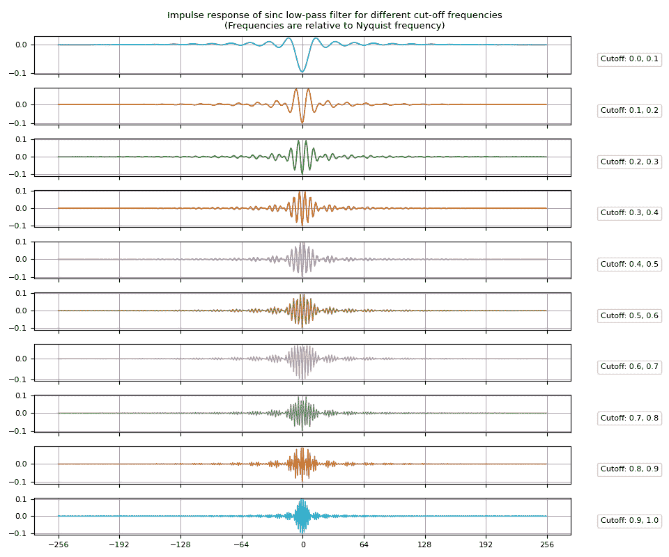
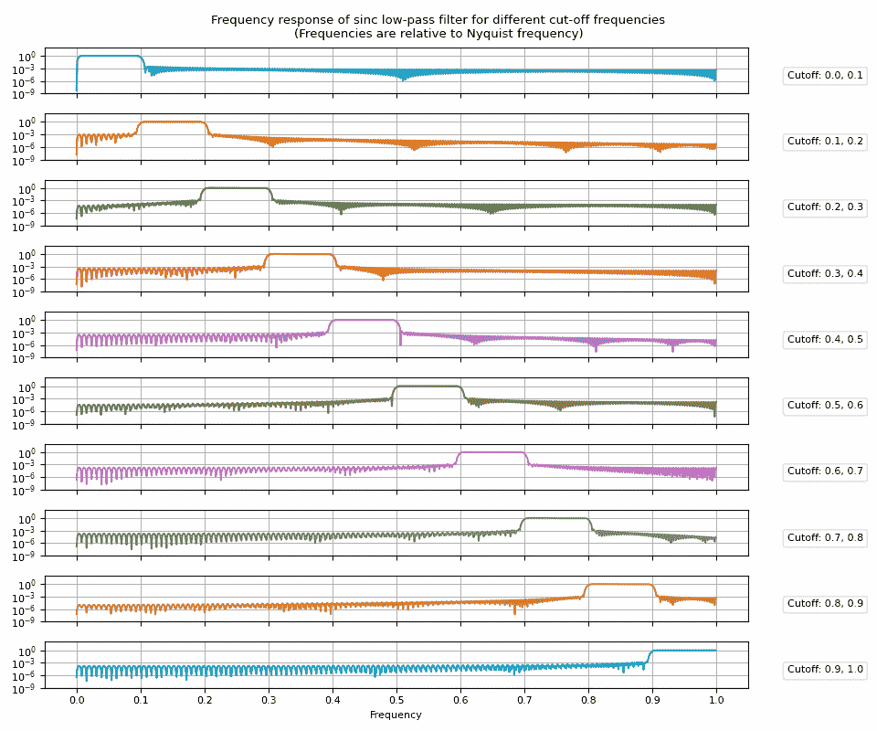
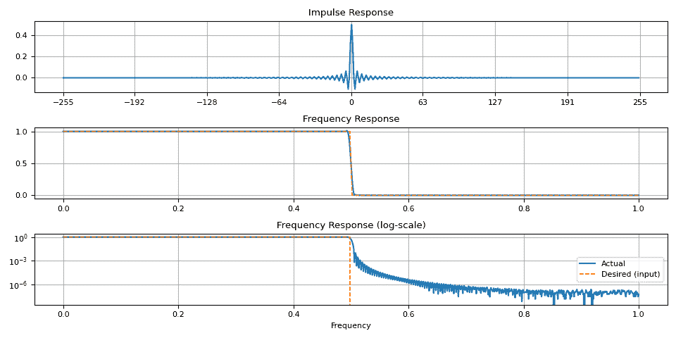
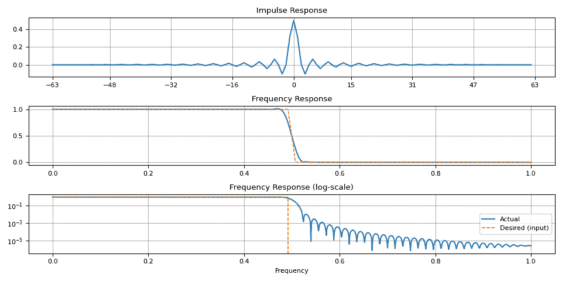
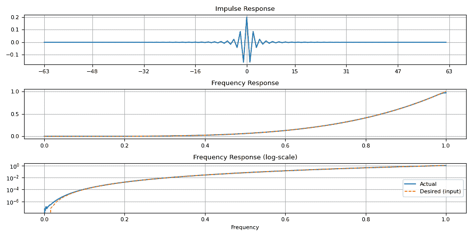
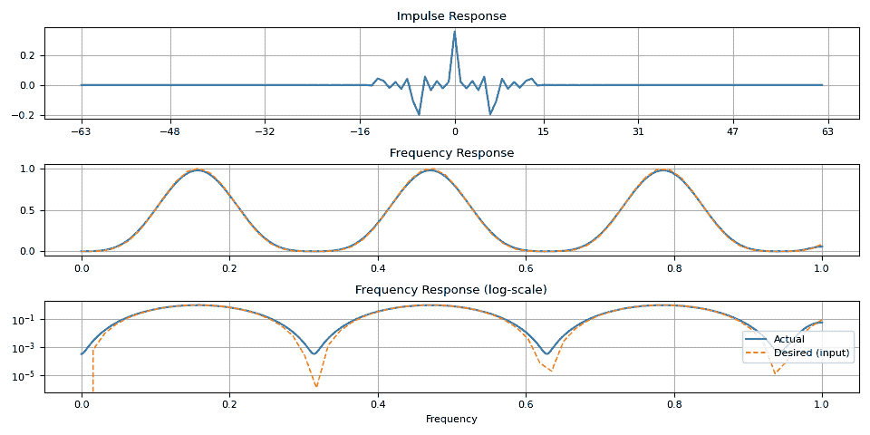

# 滤波器设计教程

> 原文：[`pytorch.org/audio/stable/tutorials/filter_design_tutorial.html`](https://pytorch.org/audio/stable/tutorials/filter_design_tutorial.html)

注意

点击这里下载完整示例代码

**作者**：Moto Hira

本教程展示了如何创建基本的数字滤波器（脉冲响应）及其属性。

我们将研究基于窗口化 sinc 核和频率采样方法的低通、高通和带通滤波器。

警告

这个教程需要原型 DSP 功能，这些功能在夜间构建中可用。

请参考[`pytorch.org/get-started/locally`](https://pytorch.org/get-started/locally)获取安装夜间构建的说明。

```py
import torch
import torchaudio

print(torch.__version__)
print([torchaudio.__version__](https://docs.python.org/3/library/stdtypes.html#str "builtins.str"))

import matplotlib.pyplot as plt 
```

```py
2.2.0
2.2.0 
```

```py
from torchaudio.prototype.functional import frequency_impulse_response, sinc_impulse_response 
```

## 窗口化 Sinc 滤波器

[Sinc 滤波器](https://en.wikipedia.org/wiki/Sinc_filter)是一个理想化的滤波器，它可以去除高于截止频率的频率而不影响较低的频率。

在分析解中，Sinc 滤波器具有无限的滤波宽度。在数值计算中，无法精确表示 sinc 滤波器，因此需要近似。

窗口化 sinc 有限脉冲响应是 sinc 滤波器的近似。首先为给定的截止频率评估 sinc 函数，然后截断滤波器边缘，并应用窗口，如汉明窗，以减少由截断引入的伪影。

`sinc_impulse_response()`为给定的截止频率生成窗口化的 sinc 脉冲响应。

### 低通滤波器

#### 脉冲响应

创建 sinc 脉冲响应就像将截止频率值传递给`sinc_impulse_response()`一样简单。

```py
[cutoff](https://pytorch.org/docs/stable/tensors.html#torch.Tensor "torch.Tensor") = [torch.linspace](https://pytorch.org/docs/stable/generated/torch.linspace.html#torch.linspace "torch.linspace")(0.0, 1.0, 9)
[irs](https://pytorch.org/docs/stable/tensors.html#torch.Tensor "torch.Tensor") = sinc_impulse_response([cutoff](https://pytorch.org/docs/stable/tensors.html#torch.Tensor "torch.Tensor"), window_size=513)

print("Cutoff shape:", [cutoff](https://pytorch.org/docs/stable/tensors.html#torch.Tensor "torch.Tensor").shape)
print("Impulse response shape:", [irs](https://pytorch.org/docs/stable/tensors.html#torch.Tensor "torch.Tensor").shape) 
```

```py
Cutoff shape: torch.Size([9])
Impulse response shape: torch.Size([9, 513]) 
```

让我们可视化结果脉冲响应。

```py
def plot_sinc_ir([irs](https://pytorch.org/docs/stable/tensors.html#torch.Tensor "torch.Tensor"), [cutoff](https://pytorch.org/docs/stable/tensors.html#torch.Tensor "torch.Tensor")):
    num_filts, window_size = [irs](https://pytorch.org/docs/stable/tensors.html#torch.Tensor "torch.Tensor").shape
    half = window_size // 2

    fig, axes = plt.subplots(num_filts, 1, sharex=True, figsize=(9.6, 8))
    t = [torch.linspace](https://pytorch.org/docs/stable/generated/torch.linspace.html#torch.linspace "torch.linspace")(-half, half - 1, window_size)
    for ax, [ir](https://pytorch.org/docs/stable/tensors.html#torch.Tensor "torch.Tensor"), [coff](https://docs.python.org/3/library/stdtypes.html#list "builtins.list"), color in zip(axes, [irs](https://pytorch.org/docs/stable/tensors.html#torch.Tensor "torch.Tensor"), [cutoff](https://pytorch.org/docs/stable/tensors.html#torch.Tensor "torch.Tensor"), [plt.cm.tab10.colors](https://docs.python.org/3/library/stdtypes.html#tuple "builtins.tuple")):
        ax.plot(t, [ir](https://pytorch.org/docs/stable/tensors.html#torch.Tensor "torch.Tensor"), linewidth=1.2, color=color, zorder=4, label=f"Cutoff: {[coff](https://docs.python.org/3/library/stdtypes.html#list "builtins.list")}")
        ax.legend(loc=(1.05, 0.2), handletextpad=0, handlelength=0)
        ax.grid(True)
    fig.suptitle(
        "Impulse response of sinc low-pass filter for different cut-off frequencies\n"
        "(Frequencies are relative to Nyquist frequency)"
    )
    axes[-1].set_xticks([i * half // 4 for i in range(-4, 5)])
    fig.tight_layout() 
```

```py
plot_sinc_ir([irs](https://pytorch.org/docs/stable/tensors.html#torch.Tensor "torch.Tensor"), [cutoff](https://pytorch.org/docs/stable/tensors.html#torch.Tensor "torch.Tensor")) 
```



#### 频率响应

接下来，让我们看看频率响应。简单地对脉冲响应应用傅立叶变换将给出频率响应。

```py
[frs](https://pytorch.org/docs/stable/tensors.html#torch.Tensor "torch.Tensor") = [torch.fft.rfft](https://pytorch.org/docs/stable/generated/torch.fft.rfft.html#torch.fft.rfft "torch.fft.rfft")([irs](https://pytorch.org/docs/stable/tensors.html#torch.Tensor "torch.Tensor"), n=2048, dim=1).abs() 
```

让我们可视化结果频率响应。

```py
def plot_sinc_fr([frs](https://pytorch.org/docs/stable/tensors.html#torch.Tensor "torch.Tensor"), [cutoff](https://pytorch.org/docs/stable/tensors.html#torch.Tensor "torch.Tensor"), band=False):
    num_filts, num_fft = [frs](https://pytorch.org/docs/stable/tensors.html#torch.Tensor "torch.Tensor").shape
    num_ticks = num_filts + 1 if band else num_filts

    fig, axes = plt.subplots(num_filts, 1, sharex=True, sharey=True, figsize=(9.6, 8))
    for ax, fr, [coff](https://docs.python.org/3/library/stdtypes.html#list "builtins.list"), color in zip(axes, [frs](https://pytorch.org/docs/stable/tensors.html#torch.Tensor "torch.Tensor"), [cutoff](https://pytorch.org/docs/stable/tensors.html#torch.Tensor "torch.Tensor"), [plt.cm.tab10.colors](https://docs.python.org/3/library/stdtypes.html#tuple "builtins.tuple")):
        ax.grid(True)
        ax.semilogy(fr, color=color, zorder=4, label=f"Cutoff: {[coff](https://docs.python.org/3/library/stdtypes.html#list "builtins.list")}")
        ax.legend(loc=(1.05, 0.2), handletextpad=0, handlelength=0).set_zorder(3)
    axes[-1].set(
        ylim=[None, 100],
        yticks=[1e-9, 1e-6, 1e-3, 1],
        xticks=[torch.linspace](https://pytorch.org/docs/stable/generated/torch.linspace.html#torch.linspace "torch.linspace")(0, num_fft, num_ticks),
        xticklabels=[f"{i/(num_ticks  -  1)}" for i in range(num_ticks)],
        xlabel="Frequency",
    )
    fig.suptitle(
        "Frequency response of sinc low-pass filter for different cut-off frequencies\n"
        "(Frequencies are relative to Nyquist frequency)"
    )
    fig.tight_layout() 
```

```py
plot_sinc_fr([frs](https://pytorch.org/docs/stable/tensors.html#torch.Tensor "torch.Tensor"), [cutoff](https://pytorch.org/docs/stable/tensors.html#torch.Tensor "torch.Tensor")) 
```



### 高通滤波器

高通滤波器可以通过从 Dirac delta 函数中减去低通脉冲响应来获得。

将`high_pass=True`传递给`sinc_impulse_response()`将使返回的滤波器核变为高通滤波器。

```py
[irs](https://pytorch.org/docs/stable/tensors.html#torch.Tensor "torch.Tensor") = sinc_impulse_response([cutoff](https://pytorch.org/docs/stable/tensors.html#torch.Tensor "torch.Tensor"), window_size=513, high_pass=True)
[frs](https://pytorch.org/docs/stable/tensors.html#torch.Tensor "torch.Tensor") = [torch.fft.rfft](https://pytorch.org/docs/stable/generated/torch.fft.rfft.html#torch.fft.rfft "torch.fft.rfft")([irs](https://pytorch.org/docs/stable/tensors.html#torch.Tensor "torch.Tensor"), n=2048, dim=1).abs() 
```

#### 脉冲响应

```py
plot_sinc_ir([irs](https://pytorch.org/docs/stable/tensors.html#torch.Tensor "torch.Tensor"), [cutoff](https://pytorch.org/docs/stable/tensors.html#torch.Tensor "torch.Tensor")) 
```



#### 频率响应

```py
plot_sinc_fr([frs](https://pytorch.org/docs/stable/tensors.html#torch.Tensor "torch.Tensor"), [cutoff](https://pytorch.org/docs/stable/tensors.html#torch.Tensor "torch.Tensor")) 
```



### 带通滤波器

带通滤波器可以通过从上频带的低通滤波器减去下频带的滤波器来获得。

```py
[cutoff](https://pytorch.org/docs/stable/tensors.html#torch.Tensor "torch.Tensor") = [torch.linspace](https://pytorch.org/docs/stable/generated/torch.linspace.html#torch.linspace "torch.linspace")(0.0, 1, 11)
[c_low](https://pytorch.org/docs/stable/tensors.html#torch.Tensor "torch.Tensor") = [cutoff](https://pytorch.org/docs/stable/tensors.html#torch.Tensor "torch.Tensor")[:-1]
[c_high](https://pytorch.org/docs/stable/tensors.html#torch.Tensor "torch.Tensor") = [cutoff](https://pytorch.org/docs/stable/tensors.html#torch.Tensor "torch.Tensor")[1:]

[irs](https://pytorch.org/docs/stable/tensors.html#torch.Tensor "torch.Tensor") = sinc_impulse_response([c_low](https://pytorch.org/docs/stable/tensors.html#torch.Tensor "torch.Tensor"), window_size=513) - sinc_impulse_response([c_high](https://pytorch.org/docs/stable/tensors.html#torch.Tensor "torch.Tensor"), window_size=513)
[frs](https://pytorch.org/docs/stable/tensors.html#torch.Tensor "torch.Tensor") = [torch.fft.rfft](https://pytorch.org/docs/stable/generated/torch.fft.rfft.html#torch.fft.rfft "torch.fft.rfft")([irs](https://pytorch.org/docs/stable/tensors.html#torch.Tensor "torch.Tensor"), n=2048, dim=1).abs() 
```

#### 脉冲响应

```py
[coff](https://docs.python.org/3/library/stdtypes.html#list "builtins.list") = [f"{l.item():.1f}, {h.item():.1f}" for l, h in zip([c_low](https://pytorch.org/docs/stable/tensors.html#torch.Tensor "torch.Tensor"), [c_high](https://pytorch.org/docs/stable/tensors.html#torch.Tensor "torch.Tensor"))]
plot_sinc_ir([irs](https://pytorch.org/docs/stable/tensors.html#torch.Tensor "torch.Tensor"), [coff](https://docs.python.org/3/library/stdtypes.html#list "builtins.list")) 
```



#### 频率响应

```py
plot_sinc_fr([frs](https://pytorch.org/docs/stable/tensors.html#torch.Tensor "torch.Tensor"), [coff](https://docs.python.org/3/library/stdtypes.html#list "builtins.list"), band=True) 
```



## 频率采样

我们接下来研究的方法是从所需的频率响应开始，通过应用逆傅立叶变换获得脉冲响应。

`frequency_impulse_response()`接受（未归一化的）频率幅度分布，并从中构建脉冲响应。

请注意，结果脉冲响应并不产生所需的频率响应。

接下来，我们创建多个滤波器并比较输入频率响应和实际频率响应。

### 矩形窗滤波器

让我们从矩形窗滤波器开始

```py
[magnitudes](https://pytorch.org/docs/stable/tensors.html#torch.Tensor "torch.Tensor") = [torch.concat](https://pytorch.org/docs/stable/generated/torch.concat.html#torch.concat "torch.concat")([[torch.ones](https://pytorch.org/docs/stable/generated/torch.ones.html#torch.ones "torch.ones")((128,)), [torch.zeros](https://pytorch.org/docs/stable/generated/torch.zeros.html#torch.zeros "torch.zeros")((128,))])
[ir](https://pytorch.org/docs/stable/tensors.html#torch.Tensor "torch.Tensor") = frequency_impulse_response([magnitudes](https://pytorch.org/docs/stable/tensors.html#torch.Tensor "torch.Tensor"))

print("Magnitudes:", [magnitudes](https://pytorch.org/docs/stable/tensors.html#torch.Tensor "torch.Tensor").shape)
print("Impulse Response:", [ir](https://pytorch.org/docs/stable/tensors.html#torch.Tensor "torch.Tensor").shape) 
```

```py
Magnitudes: torch.Size([256])
Impulse Response: torch.Size([510]) 
```

```py
def plot_ir([magnitudes](https://pytorch.org/docs/stable/tensors.html#torch.Tensor "torch.Tensor"), [ir](https://pytorch.org/docs/stable/tensors.html#torch.Tensor "torch.Tensor"), num_fft=2048):
    fr = [torch.fft.rfft](https://pytorch.org/docs/stable/generated/torch.fft.rfft.html#torch.fft.rfft "torch.fft.rfft")([ir](https://pytorch.org/docs/stable/tensors.html#torch.Tensor "torch.Tensor"), n=num_fft, dim=0).abs()
    ir_size = [ir](https://pytorch.org/docs/stable/tensors.html#torch.Tensor "torch.Tensor").size(-1)
    half = ir_size // 2

    fig, axes = plt.subplots(3, 1)
    t = [torch.linspace](https://pytorch.org/docs/stable/generated/torch.linspace.html#torch.linspace "torch.linspace")(-half, half - 1, ir_size)
    axes[0].plot(t, [ir](https://pytorch.org/docs/stable/tensors.html#torch.Tensor "torch.Tensor"))
    axes[0].grid(True)
    axes[0].set(title="Impulse Response")
    axes[0].set_xticks([i * half // 4 for i in range(-4, 5)])
    t = [torch.linspace](https://pytorch.org/docs/stable/generated/torch.linspace.html#torch.linspace "torch.linspace")(0, 1, fr.numel())
    axes[1].plot(t, fr, label="Actual")
    axes[2].semilogy(t, fr, label="Actual")
    t = [torch.linspace](https://pytorch.org/docs/stable/generated/torch.linspace.html#torch.linspace "torch.linspace")(0, 1, [magnitudes](https://pytorch.org/docs/stable/tensors.html#torch.Tensor "torch.Tensor").numel())
    for i in range(1, 3):
        axes[i].plot(t, [magnitudes](https://pytorch.org/docs/stable/tensors.html#torch.Tensor "torch.Tensor"), label="Desired (input)", linewidth=1.1, linestyle="--")
        axes[i].grid(True)
    axes[1].set(title="Frequency Response")
    axes[2].set(title="Frequency Response (log-scale)", xlabel="Frequency")
    axes[2].legend(loc="center right")
    fig.tight_layout() 
```

```py
plot_ir([magnitudes](https://pytorch.org/docs/stable/tensors.html#torch.Tensor "torch.Tensor"), [ir](https://pytorch.org/docs/stable/tensors.html#torch.Tensor "torch.Tensor")) 
```



请注意，在过渡带周围存在伪影。当窗口大小较小时，这更加明显。

```py
[magnitudes](https://pytorch.org/docs/stable/tensors.html#torch.Tensor "torch.Tensor") = [torch.concat](https://pytorch.org/docs/stable/generated/torch.concat.html#torch.concat "torch.concat")([[torch.ones](https://pytorch.org/docs/stable/generated/torch.ones.html#torch.ones "torch.ones")((32,)), [torch.zeros](https://pytorch.org/docs/stable/generated/torch.zeros.html#torch.zeros "torch.zeros")((32,))])
[ir](https://pytorch.org/docs/stable/tensors.html#torch.Tensor "torch.Tensor") = frequency_impulse_response([magnitudes](https://pytorch.org/docs/stable/tensors.html#torch.Tensor "torch.Tensor")) 
```

```py
plot_ir([magnitudes](https://pytorch.org/docs/stable/tensors.html#torch.Tensor "torch.Tensor"), [ir](https://pytorch.org/docs/stable/tensors.html#torch.Tensor "torch.Tensor")) 
```



### 任意形状

```py
[magnitudes](https://pytorch.org/docs/stable/tensors.html#torch.Tensor "torch.Tensor") = [torch.linspace](https://pytorch.org/docs/stable/generated/torch.linspace.html#torch.linspace "torch.linspace")(0, 1, 64) ** 4.0
[ir](https://pytorch.org/docs/stable/tensors.html#torch.Tensor "torch.Tensor") = frequency_impulse_response([magnitudes](https://pytorch.org/docs/stable/tensors.html#torch.Tensor "torch.Tensor")) 
```

```py
plot_ir([magnitudes](https://pytorch.org/docs/stable/tensors.html#torch.Tensor "torch.Tensor"), [ir](https://pytorch.org/docs/stable/tensors.html#torch.Tensor "torch.Tensor")) 
```



```py
[magnitudes](https://pytorch.org/docs/stable/tensors.html#torch.Tensor "torch.Tensor") = [torch.sin](https://pytorch.org/docs/stable/generated/torch.sin.html#torch.sin "torch.sin")([torch.linspace](https://pytorch.org/docs/stable/generated/torch.linspace.html#torch.linspace "torch.linspace")(0, 10, 64)) ** 4.0
[ir](https://pytorch.org/docs/stable/tensors.html#torch.Tensor "torch.Tensor") = frequency_impulse_response([magnitudes](https://pytorch.org/docs/stable/tensors.html#torch.Tensor "torch.Tensor")) 
```

```py
plot_ir([magnitudes](https://pytorch.org/docs/stable/tensors.html#torch.Tensor "torch.Tensor"), [ir](https://pytorch.org/docs/stable/tensors.html#torch.Tensor "torch.Tensor")) 
```



## 参考资料

+   [`en.wikipedia.org/wiki/Sinc_filter`](https://en.wikipedia.org/wiki/Sinc_filter)

+   [`www.analog.com/media/en/technical-documentation/dsp-book/dsp_book_Ch16.pdf`](https://www.analog.com/media/en/technical-documentation/dsp-book/dsp_book_Ch16.pdf)

+   [`courses.engr.illinois.edu/ece401/fa2020/slides/lec10.pdf`](https://courses.engr.illinois.edu/ece401/fa2020/slides/lec10.pdf)

+   [`ccrma.stanford.edu/~jos/sasp/Windowing_Desired_Impulse_Response.html`](https://ccrma.stanford.edu/~jos/sasp/Windowing_Desired_Impulse_Response.html)

脚本的总运行时间：（0 分钟 5.087 秒）

`下载 Python 源代码：filter_design_tutorial.py`

`下载 Jupyter 笔记本：filter_design_tutorial.ipynb`

[Sphinx-Gallery 生成的画廊](https://sphinx-gallery.github.io)
