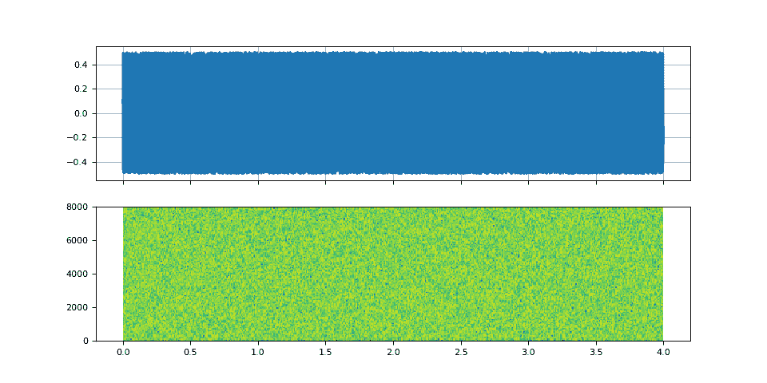
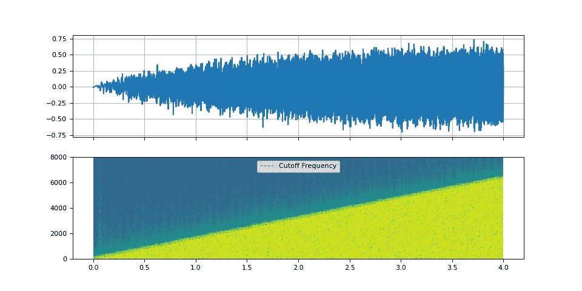
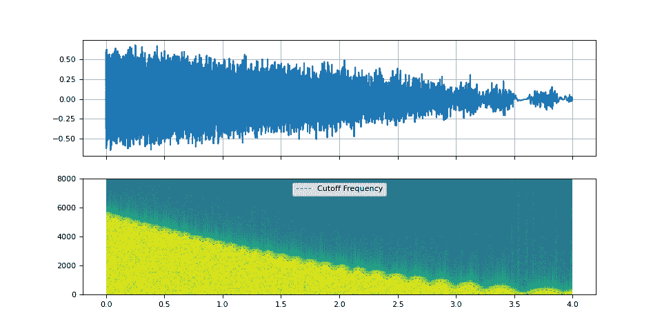
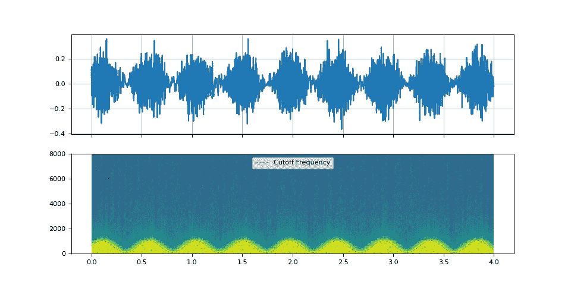
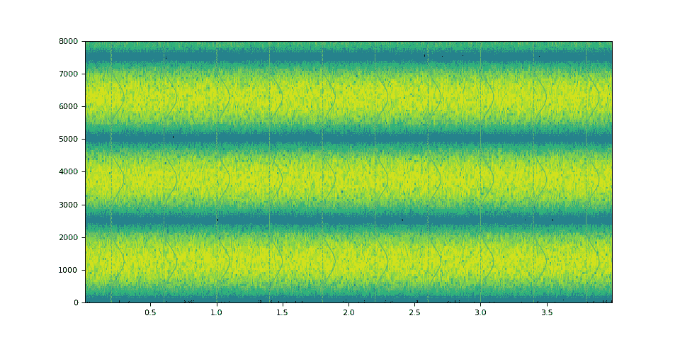
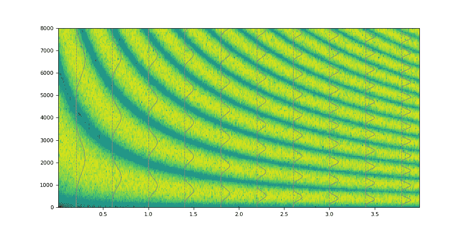
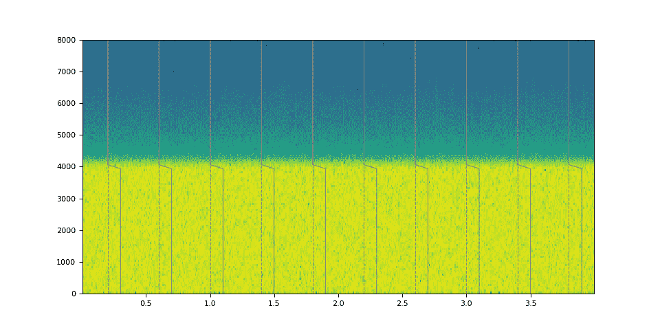

# 减法合成

> 原文：[`pytorch.org/audio/stable/tutorials/subtractive_synthesis_tutorial.html`](https://pytorch.org/audio/stable/tutorials/subtractive_synthesis_tutorial.html)
>
> 译者：[飞龙](https://github.com/wizardforcel)
>
> 协议：[CC BY-NC-SA 4.0](http://creativecommons.org/licenses/by-nc-sa/4.0/)


注意

点击这里下载完整示例代码

**作者**：Moto Hira

这个教程是滤波器设计教程的延续。

本教程展示了如何使用 TorchAudio 的 DSP 函数执行减法合成。

减法合成通过将滤波器应用于源波形来创建音色。

警告

这个教程需要原型 DSP 功能，这些功能在夜间构建中可用。

请参考[`pytorch.org/get-started/locally`](https://pytorch.org/get-started/locally)获取夜间构建的安装说明。

```py
import torch
import torchaudio

print(torch.__version__)
print(torchaudio.__version__) 
```

```py
2.2.0
2.2.0 
```

## 概述

```py
try:
    from torchaudio.prototype.functional import filter_waveform, frequency_impulse_response, sinc_impulse_response
except ModuleNotFoundError:
    print(
        "Failed to import prototype DSP features. "
        "Please install torchaudio nightly builds. "
        "Please refer to https://pytorch.org/get-started/locally "
        "for instructions to install a nightly build."
    )
    raise

import matplotlib.pyplot as plt
from IPython.display import Audio 
```

## 滤波噪声

减法合成从波形开始，并将滤波器应用于一些频率成分。

对于减法合成的第一个示例，我们将时变低通滤波器应用于白噪声。

首先，我们创建一个白噪声。

```py
SAMPLE_RATE = 16_000
duration = 4
num_frames = int(duration * SAMPLE_RATE)

noise = torch.rand((num_frames,)) - 0.5 
```

```py
def plot_input():
    fig, axes = plt.subplots(2, 1, sharex=True)
    t = torch.linspace(0, duration, num_frames)
    axes[0].plot(t, noise)
    axes[0].grid(True)
    axes[1].specgram(noise, Fs=SAMPLE_RATE)
    Audio(noise, rate=SAMPLE_RATE)

plot_input() 
```



## 窗口化 sinc 滤波器

### 扫描截止频率

我们使用`sinc_impulse_response()`创建一系列低通滤波器，同时将截止频率从零变化到奈奎斯特频率。

```py
num_filters = 64 * duration
window_size = 2049

f_cutoff = torch.linspace(0.0, 0.8, num_filters)
kernel = sinc_impulse_response(f_cutoff, window_size) 
```

要应用时变滤波器，我们使用`filter_waveform()`

```py
filtered = filter_waveform(noise, kernel) 
```

让我们看看生成音频的频谱图，并听一听。

```py
def plot_sinc_ir(waveform, cutoff, sample_rate, vol=0.2):
    num_frames = waveform.size(0)
    duration = num_frames / sample_rate
    num_cutoff = cutoff.size(0)
    nyquist = sample_rate / 2

    _, axes = plt.subplots(2, 1, sharex=True)
    t = torch.linspace(0, duration, num_frames)
    axes[0].plot(t, waveform)
    axes[0].grid(True)
    axes[1].specgram(waveform, Fs=sample_rate, scale="dB")
    t = torch.linspace(0, duration, num_cutoff)
    axes[1].plot(t, cutoff * nyquist, color="gray", linewidth=0.8, label="Cutoff Frequency", linestyle="--")
    axes[1].legend(loc="upper center")
    axes[1].set_ylim([0, nyquist])
    waveform /= waveform.abs().max()
    return Audio(vol * waveform, rate=sample_rate, normalize=False) 
```

```py
plot_sinc_ir(filtered, f_cutoff, SAMPLE_RATE) 
```



您的浏览器不支持音频元素。

### 振荡截止频率

通过振荡截止频率，我们可以模拟低频振荡（LFO）的效果。

```py
PI2 = torch.pi * 2
num_filters = 90 * duration

f_lfo = torch.linspace(0.9, 0.1, num_filters)
f_cutoff_osci = torch.linspace(0.01, 0.03, num_filters) * torch.sin(torch.cumsum(f_lfo, dim=0))
f_cutoff_base = torch.linspace(0.8, 0.03, num_filters) ** 1.7
f_cutoff = f_cutoff_base + f_cutoff_osci 
```

```py
kernel = sinc_impulse_response(f_cutoff, window_size)
filtered = filter_waveform(noise, kernel) 
```

```py
plot_sinc_ir(filtered, f_cutoff, SAMPLE_RATE) 
```



您的浏览器不支持音频元素。

### 哇哇效果

哇哇效果是低通滤波器或带通滤波器的应用。它们快速改变截止频率或 Q 值。

```py
f_lfo = torch.linspace(0.15, 0.15, num_filters)
f_cutoff = 0.07 + 0.06 * torch.sin(torch.cumsum(f_lfo, dim=0)) 
```

```py
kernel = sinc_impulse_response(f_cutoff, window_size)
filtered = filter_waveform(noise, kernel) 
```

```py
plot_sinc_ir(filtered, f_cutoff, SAMPLE_RATE) 
```



您的浏览器不支持音频元素。

## 任意频率响应

通过使用`frequency_impulse_response()`，可以直接控制频率上的功率分布。

```py
magnitudes = torch.sin(torch.linspace(0, 10, 64)) ** 4.0
kernel = frequency_impulse_response(magnitudes)
filtered = filter_waveform(noise, kernel.unsqueeze(0)) 
```

```py
def plot_waveform(magnitudes, filtered, sample_rate):
    nyquist = sample_rate / 2
    num_samples = filtered.size(-1)
    duration = num_samples / sample_rate

    # Re-organize magnitudes for overlay
    N = 10  # number of overlays
    interval = torch.linspace(0.05, 0.95, N)
    offsets = duration * interval
    # Select N magnitudes for overlays
    mags = torch.stack(
        [magnitudes for _ in range(N)]
        if magnitudes.ndim == 1
        else [magnitudes[int(i * magnitudes.size(0))] for i in interval]
    )
    mag_x = offsets.unsqueeze(-1) + 0.1 * mags
    mag_y = torch.linspace(0, nyquist, magnitudes.size(-1)).tile((N, 1))

    _, ax = plt.subplots(1, 1, sharex=True)
    ax.vlines(offsets, 0, nyquist, color="gray", linestyle="--", linewidth=0.8)
    ax.plot(mag_x.T.numpy(), mag_y.T.numpy(), color="gray", linewidth=0.8)
    ax.specgram(filtered, Fs=sample_rate)
    return Audio(filtered, rate=sample_rate) 
```

```py
plot_waveform(magnitudes, filtered, SAMPLE_RATE) 
```



您的浏览器不支持音频元素。

也可以制作非稳态滤波器。

```py
magnitudes = torch.stack([torch.linspace(0.0, w, 1000) for w in torch.linspace(4.0, 40.0, 250)])
magnitudes = torch.sin(magnitudes) ** 4.0 
```

```py
kernel = frequency_impulse_response(magnitudes)
filtered = filter_waveform(noise, kernel) 
```

```py
plot_waveform(magnitudes, filtered, SAMPLE_RATE) 
```



您的浏览器不支持音频元素。

当然也可以模拟简单的低通滤波器。

```py
magnitudes = torch.concat([torch.ones((32,)), torch.zeros((32,))]) 
```

```py
kernel = frequency_impulse_response(magnitudes)
filtered = filter_waveform(noise, kernel.unsqueeze(0)) 
```

```py
plot_waveform(magnitudes, filtered, SAMPLE_RATE) 
```



您的浏览器不支持音频元素。

## 参考

+   [`en.wikipedia.org/wiki/Additive_synthesis`](https://en.wikipedia.org/wiki/Additive_synthesis)

+   [`computermusicresource.com/Simple.bell.tutorial.html`](https://computermusicresource.com/Simple.bell.tutorial.html)

+   [`computermusicresource.com/Definitions/additive.synthesis.html`](https://computermusicresource.com/Definitions/additive.synthesis.html)

**脚本的总运行时间：**（0 分钟 7.629 秒）

`下载 Python 源代码：subtractive_synthesis_tutorial.py`

`下载 Jupyter 笔记本：subtractive_synthesis_tutorial.ipynb`

[Sphinx-Gallery 生成的图库](https://sphinx-gallery.github.io)
