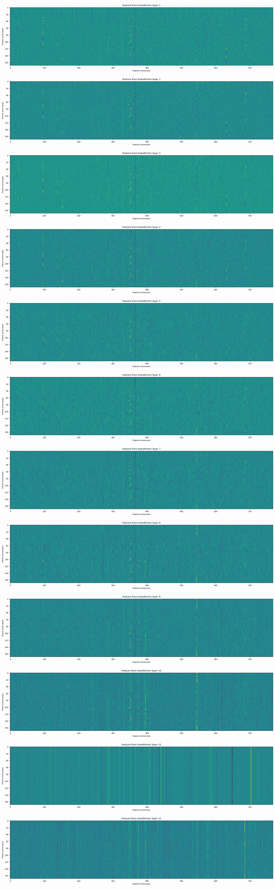
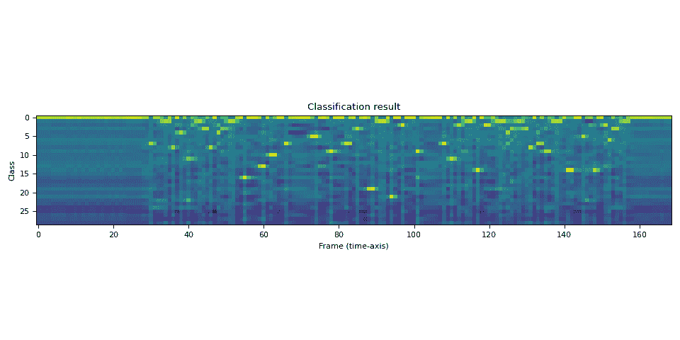

# 使用 Wav2Vec2 进行语音识别

> 原文：[`pytorch.org/audio/stable/tutorials/speech_recognition_pipeline_tutorial.html`](https://pytorch.org/audio/stable/tutorials/speech_recognition_pipeline_tutorial.html)
>
> 译者：[飞龙](https://github.com/wizardforcel)
>
> 协议：[CC BY-NC-SA 4.0](http://creativecommons.org/licenses/by-nc-sa/4.0/)


注意

点击这里下载完整示例代码

**作者**：Moto Hira

本教程展示了如何使用来自 wav2vec 2.0 的预训练模型执行语音识别[[论文](https://arxiv.org/abs/2006.11477)]。

## 概述

语音识别的过程如下所示。

1.  从音频波形中提取声学特征

1.  逐帧估计声学特征的类别

1.  从类概率序列生成假设

Torchaudio 提供了对预训练权重和相关信息的简单访问，例如预期的采样率和类标签。它们被捆绑在一起，并在`torchaudio.pipelines`模块下提供。

## 准备

```py
import torch
import torchaudio

print(torch.__version__)
print([torchaudio.__version__](https://docs.python.org/3/library/stdtypes.html#str "builtins.str"))

[torch.random.manual_seed](https://pytorch.org/docs/stable/generated/torch.manual_seed.html#torch.manual_seed "torch.manual_seed")(0)
[device](https://pytorch.org/docs/stable/tensor_attributes.html#torch.device "torch.device") = [torch.device](https://pytorch.org/docs/stable/tensor_attributes.html#torch.device "torch.device")("cuda" if [torch.cuda.is_available](https://pytorch.org/docs/stable/generated/torch.cuda.is_available.html#torch.cuda.is_available "torch.cuda.is_available")() else "cpu")

print([device](https://pytorch.org/docs/stable/tensor_attributes.html#torch.device "torch.device")) 
```

```py
2.2.0
2.2.0
cuda 
```

```py
import IPython
import matplotlib.pyplot as plt
from torchaudio.utils import download_asset

[SPEECH_FILE](https://docs.python.org/3/library/stdtypes.html#str "builtins.str") = download_asset("tutorial-assets/Lab41-SRI-VOiCES-src-sp0307-ch127535-sg0042.wav") 
```

```py
 0%|          | 0.00/106k [00:00<?, ?B/s]
100%|##########| 106k/106k [00:00<00:00, 51.7MB/s] 
```

## 创建管道

首先，我们将创建一个执行特征提取和分类的 Wav2Vec2 模型。

torchaudio 中有两种类型的 Wav2Vec2 预训练权重。一种是为 ASR 任务微调的，另一种是未经微调的。

Wav2Vec2（和 HuBERT）模型以自监督方式进行训练。它们首先仅使用音频进行表示学习的训练，然后再使用附加标签进行特定任务的微调。

未经微调的预训练权重也可以用于其他下游任务的微调，但本教程不涵盖此内容。

我们将在这里使用`torchaudio.pipelines.WAV2VEC2_ASR_BASE_960H`。

`torchaudio.pipelines`中有多个预训练模型可用。请查看文档以了解它们的训练方式的详细信息。

bundle 对象提供了实例化模型和其他信息的接口。采样率和类标签如下所示。

```py
bundle = torchaudio.pipelines.WAV2VEC2_ASR_BASE_960H

print("Sample Rate:", bundle.[sample_rate](https://docs.python.org/3/library/functions.html#int "builtins.int"))

print("Labels:", bundle.get_labels()) 
```

```py
Sample Rate: 16000
Labels: ('-', '|', 'E', 'T', 'A', 'O', 'N', 'I', 'H', 'S', 'R', 'D', 'L', 'U', 'M', 'W', 'C', 'F', 'G', 'Y', 'P', 'B', 'V', 'K', "'", 'X', 'J', 'Q', 'Z') 
```

模型可以按以下方式构建。此过程将自动获取预训练权重并将其加载到模型中。

```py
model = bundle.get_model().to([device](https://pytorch.org/docs/stable/tensor_attributes.html#torch.device "torch.device"))

print(model.__class__) 
```

```py
Downloading: "https://download.pytorch.org/torchaudio/models/wav2vec2_fairseq_base_ls960_asr_ls960.pth" to /root/.cache/torch/hub/checkpoints/wav2vec2_fairseq_base_ls960_asr_ls960.pth

  0%|          | 0.00/360M [00:00<?, ?B/s]
  3%|2         | 10.5M/360M [00:00<00:03, 110MB/s]
  6%|6         | 22.9M/360M [00:00<00:02, 121MB/s]
 17%|#6        | 60.7M/360M [00:00<00:01, 247MB/s]
 29%|##8       | 103M/360M [00:00<00:00, 323MB/s]
 37%|###7      | 134M/360M [00:00<00:00, 325MB/s]
 47%|####7     | 170M/360M [00:00<00:00, 342MB/s]
 57%|#####6    | 204M/360M [00:00<00:00, 348MB/s]
 70%|######9   | 250M/360M [00:00<00:00, 391MB/s]
 80%|#######9  | 288M/360M [00:00<00:00, 374MB/s]
 90%|########9 | 323M/360M [00:01<00:00, 366MB/s]
100%|#########9| 358M/360M [00:01<00:00, 309MB/s]
100%|##########| 360M/360M [00:01<00:00, 317MB/s]
<class 'torchaudio.models.wav2vec2.model.Wav2Vec2Model'> 
```

## 加载数据

我们将使用[VOiCES 数据集](https://iqtlabs.github.io/voices/)中的语音数据，该数据集在 Creative Commos BY 4.0 下许可。

```py
IPython.display.Audio([SPEECH_FILE](https://docs.python.org/3/library/stdtypes.html#str "builtins.str")) 
```

您的浏览器不支持音频元素。

为了加载数据，我们使用`torchaudio.load()`。

如果采样率与管道期望的不同，则可以使用`torchaudio.functional.resample()`进行重采样。

注意

+   `torchaudio.functional.resample()`也适用于 CUDA 张量。

+   在同一组采样率上多次执行重采样时，使用`torchaudio.transforms.Resample`可能会提高性能。

```py
[waveform](https://pytorch.org/docs/stable/tensors.html#torch.Tensor "torch.Tensor"), [sample_rate](https://docs.python.org/3/library/functions.html#int "builtins.int") = torchaudio.load([SPEECH_FILE](https://docs.python.org/3/library/stdtypes.html#str "builtins.str"))
[waveform](https://pytorch.org/docs/stable/tensors.html#torch.Tensor "torch.Tensor") = [waveform](https://pytorch.org/docs/stable/tensors.html#torch.Tensor "torch.Tensor").to([device](https://pytorch.org/docs/stable/tensor_attributes.html#torch.device "torch.device"))

if [sample_rate](https://docs.python.org/3/library/functions.html#int "builtins.int") != bundle.[sample_rate](https://docs.python.org/3/library/functions.html#int "builtins.int"):
    [waveform](https://pytorch.org/docs/stable/tensors.html#torch.Tensor "torch.Tensor") = torchaudio.functional.resample([waveform](https://pytorch.org/docs/stable/tensors.html#torch.Tensor "torch.Tensor"), [sample_rate](https://docs.python.org/3/library/functions.html#int "builtins.int"), bundle.[sample_rate](https://docs.python.org/3/library/functions.html#int "builtins.int")) 
```

## 提取声学特征

下一步是从音频中提取声学特征。

注意

为 ASR 任务微调的 Wav2Vec2 模型可以一步完成特征提取和分类，但为了教程的目的，我们还展示了如何在此处执行特征提取。

```py
with [torch.inference_mode](https://pytorch.org/docs/stable/generated/torch.inference_mode.html#torch.inference_mode "torch.inference_mode")():
    [features](https://docs.python.org/3/library/stdtypes.html#list "builtins.list"), _ = model.extract_features([waveform](https://pytorch.org/docs/stable/tensors.html#torch.Tensor "torch.Tensor")) 
```

返回的特征是一个张量列表。每个张量是一个变换器层的输出。

```py
fig, [ax](https://numpy.org/doc/stable/reference/generated/numpy.ndarray.html#numpy.ndarray "numpy.ndarray") = plt.subplots(len([features](https://docs.python.org/3/library/stdtypes.html#list "builtins.list")), 1, figsize=(16, 4.3 * len([features](https://docs.python.org/3/library/stdtypes.html#list "builtins.list"))))
for [i](https://docs.python.org/3/library/functions.html#int "builtins.int"), [feats](https://pytorch.org/docs/stable/tensors.html#torch.Tensor "torch.Tensor") in enumerate([features](https://docs.python.org/3/library/stdtypes.html#list "builtins.list")):
    [ax](https://numpy.org/doc/stable/reference/generated/numpy.ndarray.html#numpy.ndarray "numpy.ndarray")[[i](https://docs.python.org/3/library/functions.html#int "builtins.int")].imshow([feats](https://pytorch.org/docs/stable/tensors.html#torch.Tensor "torch.Tensor")[0].cpu(), interpolation="nearest")
    [ax](https://numpy.org/doc/stable/reference/generated/numpy.ndarray.html#numpy.ndarray "numpy.ndarray")[[i](https://docs.python.org/3/library/functions.html#int "builtins.int")].set_title(f"Feature from transformer layer {[i](https://docs.python.org/3/library/functions.html#int "builtins.int")+1}")
    [ax](https://numpy.org/doc/stable/reference/generated/numpy.ndarray.html#numpy.ndarray "numpy.ndarray")[[i](https://docs.python.org/3/library/functions.html#int "builtins.int")].set_xlabel("Feature dimension")
    [ax](https://numpy.org/doc/stable/reference/generated/numpy.ndarray.html#numpy.ndarray "numpy.ndarray")[[i](https://docs.python.org/3/library/functions.html#int "builtins.int")].set_ylabel("Frame (time-axis)")
fig.tight_layout() 
```



## 特征分类

一旦提取了声学特征，下一步就是将它们分类到一组类别中。

Wav2Vec2 模型提供了一种在一步中执行特征提取和分类的方法。

```py
with [torch.inference_mode](https://pytorch.org/docs/stable/generated/torch.inference_mode.html#torch.inference_mode "torch.inference_mode")():
    [emission](https://pytorch.org/docs/stable/tensors.html#torch.Tensor "torch.Tensor"), _ = model([waveform](https://pytorch.org/docs/stable/tensors.html#torch.Tensor "torch.Tensor")) 
```

输出以 logits 的形式呈现，而不是概率的形式。

让我们可视化这个过程。

```py
plt.imshow([emission](https://pytorch.org/docs/stable/tensors.html#torch.Tensor "torch.Tensor")[0].cpu().T, interpolation="nearest")
plt.title("Classification result")
plt.xlabel("Frame (time-axis)")
plt.ylabel("Class")
plt.tight_layout()
print("Class labels:", bundle.get_labels()) 
```



```py
Class labels: ('-', '|', 'E', 'T', 'A', 'O', 'N', 'I', 'H', 'S', 'R', 'D', 'L', 'U', 'M', 'W', 'C', 'F', 'G', 'Y', 'P', 'B', 'V', 'K', "'", 'X', 'J', 'Q', 'Z') 
```

我们可以看到在时间线上有对某些标签的强烈指示。

## 生成转录

从标签概率序列中，现在我们想生成转录。生成假设的过程通常称为“解码”。

解码比简单分类更复杂，因为在某个时间步骤的解码可能会受到周围观察的影响。

例如，拿一个词像`night`和`knight`。即使它们的先验概率分布不同（在典型对话中，`night`会比`knight`发生得更频繁），为了准确生成带有`knight`的转录，比如`a knight with a sword`，解码过程必须推迟最终决定，直到看到足够的上下文。

有许多提出的解码技术，它们需要外部资源，如单词词典和语言模型。

在本教程中，为了简单起见，我们将执行贪婪解码，它不依赖于外部组件，并且只在每个时间步骤选择最佳假设。因此，上下文信息未被使用，只能生成一个转录。

我们首先定义贪婪解码算法。

```py
class GreedyCTCDecoder([torch.nn.Module](https://pytorch.org/docs/stable/generated/torch.nn.Module.html#torch.nn.Module "torch.nn.Module")):
    def __init__(self, labels, blank=0):
        super().__init__()
        self.labels = labels
        self.blank = blank

    def forward(self, [emission](https://pytorch.org/docs/stable/tensors.html#torch.Tensor "torch.Tensor"): [torch.Tensor](https://pytorch.org/docs/stable/tensors.html#torch.Tensor "torch.Tensor")) -> str:
  """Given a sequence emission over labels, get the best path string
 Args:
 emission (Tensor): Logit tensors. Shape `[num_seq, num_label]`.

 Returns:
 str: The resulting transcript
 """
        indices = [torch.argmax](https://pytorch.org/docs/stable/generated/torch.argmax.html#torch.argmax "torch.argmax")([emission](https://pytorch.org/docs/stable/tensors.html#torch.Tensor "torch.Tensor"), dim=-1)  # [num_seq,]
        indices = [torch.unique_consecutive](https://pytorch.org/docs/stable/generated/torch.unique_consecutive.html#torch.unique_consecutive "torch.unique_consecutive")(indices, dim=-1)
        indices = [[i](https://docs.python.org/3/library/functions.html#int "builtins.int") for [i](https://docs.python.org/3/library/functions.html#int "builtins.int") in indices if [i](https://docs.python.org/3/library/functions.html#int "builtins.int") != self.blank]
        return "".join([self.labels[[i](https://docs.python.org/3/library/functions.html#int "builtins.int")] for [i](https://docs.python.org/3/library/functions.html#int "builtins.int") in indices]) 
```

现在创建解码器对象并解码转录。

```py
decoder = [GreedyCTCDecoder](https://pytorch.org/docs/stable/generated/torch.nn.Module.html#torch.nn.Module "torch.nn.Module")(labels=bundle.get_labels())
[transcript](https://docs.python.org/3/library/stdtypes.html#str "builtins.str") = decoder([emission](https://pytorch.org/docs/stable/tensors.html#torch.Tensor "torch.Tensor")[0]) 
```

让我们检查结果并再次听音频。

```py
print([transcript](https://docs.python.org/3/library/stdtypes.html#str "builtins.str"))
IPython.display.Audio([SPEECH_FILE](https://docs.python.org/3/library/stdtypes.html#str "builtins.str")) 
```

```py
I|HAD|THAT|CURIOSITY|BESIDE|ME|AT|THIS|MOMENT| 
```

您的浏览器不支持音频元素。

ASR 模型使用一种称为连接主义时间分类（CTC）的损失函数进行微调。CTC 损失的详细信息在[这里](https://distill.pub/2017/ctc/)有解释。在 CTC 中，空白标记（ϵ）是一个特殊标记，表示前一个符号的重复。在解码中，这些标记被简单地忽略。

## 结论

在本教程中，我们看了如何使用`Wav2Vec2ASRBundle`执行声学特征提取和语音识别。构建模型并获取发射只需两行代码。

```py
model = torchaudio.pipelines.WAV2VEC2_ASR_BASE_960H.get_model()
[emission](https://pytorch.org/docs/stable/tensors.html#torch.Tensor "torch.Tensor") = model(waveforms, ...) 
```

**脚本的总运行时间：**（0 分钟 6.833 秒）

`下载 Python 源代码：speech_recognition_pipeline_tutorial.py`

`下载 Jupyter 笔记本：speech_recognition_pipeline_tutorial.ipynb`

[Sphinx-Gallery 生成的图库](https://sphinx-gallery.github.io)
