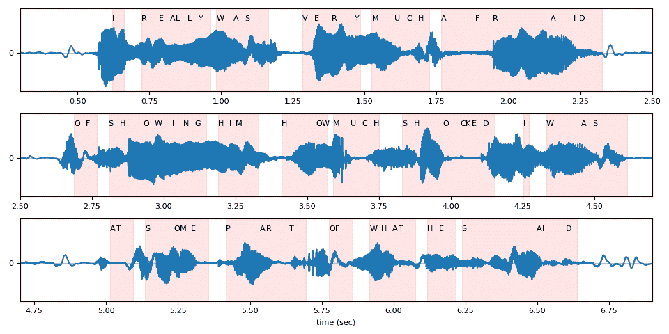

# 使用 CTC 解码器进行 ASR 推断

> 原文：[`pytorch.org/audio/stable/tutorials/asr_inference_with_ctc_decoder_tutorial.html`](https://pytorch.org/audio/stable/tutorials/asr_inference_with_ctc_decoder_tutorial.html)

注意

点击这里下载完整示例代码

**作者**：Caroline Chen

本教程展示了如何使用带有词典约束和 KenLM 语言模型支持的 CTC 波束搜索解码器执行语音识别推断。我们在使用 CTC 损失训练的预训练 wav2vec 2.0 模型上演示了这一点。

## 概述

波束搜索解码通过迭代扩展文本假设（波束）并使用下一个可能的字符，每个时间步仅保留具有最高分数的假设来工作。语言模型可以并入到得分计算中，添加词典约束会限制假设的下一个可能令牌，以便只能生成词典中的单词。

底层实现是从[Flashlight](https://arxiv.org/pdf/2201.12465.pdf)的波束搜索解码器移植过来的。解码器优化的数学公式可以在[Wav2Letter 论文](https://arxiv.org/pdf/1609.03193.pdf)中找到，更详细的算法可以在这篇[博客](https://towardsdatascience.com/boosting-your-sequence-generation-performance-with-beam-search-language-model-decoding-74ee64de435a)中找到。

使用带有语言模型和词典约束的 CTC 波束搜索解码器进行 ASR 推断需要以下组件

+   声学模型：从音频波形预测语音学的模型

+   令牌：声学模型可能预测的令牌

+   词典：可能单词与其对应的令牌序列之间的映射

+   语言模型（LM）：使用[KenLM 库](https://kheafield.com/code/kenlm/)训练的 n-gram 语言模型，或者继承了`CTCDecoderLM`的自定义语言模型

## 声学模型和设置

首先，我们导入必要的工具并获取我们正在处理的数据

```py
import torch
import torchaudio

print(torch.__version__)
print([torchaudio.__version__](https://docs.python.org/3/library/stdtypes.html#str "builtins.str")) 
```

```py
2.2.0
2.2.0 
```

```py
import time
from typing import [List](https://docs.python.org/3/library/typing.html#typing.List "typing.List")

import IPython
import matplotlib.pyplot as plt
from torchaudio.models.decoder import ctc_decoder
from torchaudio.utils import download_asset 
```

我们使用预训练的[Wav2Vec 2.0](https://arxiv.org/abs/2006.11477)基础模型，该模型在 10 分钟的[LibriSpeech 数据集](http://www.openslr.org/12)上进行了微调，可以使用`torchaudio.pipelines.WAV2VEC2_ASR_BASE_10M`加载。有关在 torchaudio 中运行 Wav2Vec 2.0 语音识别流水线的更多详细信息，请参考此教程。

```py
bundle = torchaudio.pipelines.WAV2VEC2_ASR_BASE_10M
acoustic_model = bundle.get_model() 
```

```py
Downloading: "https://download.pytorch.org/torchaudio/models/wav2vec2_fairseq_base_ls960_asr_ll10m.pth" to /root/.cache/torch/hub/checkpoints/wav2vec2_fairseq_base_ls960_asr_ll10m.pth

  0%|          | 0.00/360M [00:00<?, ?B/s]
  8%|8         | 29.4M/360M [00:00<00:01, 308MB/s]
 19%|#9        | 68.9M/360M [00:00<00:00, 371MB/s]
 30%|##9       | 108M/360M [00:00<00:00, 387MB/s]
 42%|####2     | 152M/360M [00:00<00:00, 417MB/s]
 55%|#####4    | 198M/360M [00:00<00:00, 441MB/s]
 67%|######6   | 240M/360M [00:00<00:00, 438MB/s]
 78%|#######8  | 282M/360M [00:00<00:00, 424MB/s]
 91%|######### | 327M/360M [00:00<00:00, 440MB/s]
100%|##########| 360M/360M [00:00<00:00, 409MB/s] 
```

我们将从 LibriSpeech 测试集中加载一个样本。

```py
[speech_file](https://docs.python.org/3/library/stdtypes.html#str "builtins.str") = download_asset("tutorial-assets/ctc-decoding/1688-142285-0007.wav")

IPython.display.Audio([speech_file](https://docs.python.org/3/library/stdtypes.html#str "builtins.str")) 
```

您的浏览器不支持音频元素。

与此音频文件对应的转录本是

```py
[i](https://docs.python.org/3/library/functions.html#int "builtins.int") really was very much afraid of showing him how much shocked [i](https://docs.python.org/3/library/functions.html#int "builtins.int") was at some parts of what he said 
```

```py
[waveform](https://pytorch.org/docs/stable/tensors.html#torch.Tensor "torch.Tensor"), [sample_rate](https://docs.python.org/3/library/functions.html#int "builtins.int") = torchaudio.load([speech_file](https://docs.python.org/3/library/stdtypes.html#str "builtins.str"))

if [sample_rate](https://docs.python.org/3/library/functions.html#int "builtins.int") != bundle.[sample_rate](https://docs.python.org/3/library/functions.html#int "builtins.int"):
    [waveform](https://pytorch.org/docs/stable/tensors.html#torch.Tensor "torch.Tensor") = torchaudio.functional.resample([waveform](https://pytorch.org/docs/stable/tensors.html#torch.Tensor "torch.Tensor"), [sample_rate](https://docs.python.org/3/library/functions.html#int "builtins.int"), bundle.[sample_rate](https://docs.python.org/3/library/functions.html#int "builtins.int")) 
```

## 解码器的文件和数据

接下来，我们加载我们的令牌、词典和语言模型数据，这些数据由解码器用于从声学模型输出中预测单词。LibriSpeech 数据集的预训练文件可以通过 torchaudio 下载，或者用户可以提供自己的文件。

### 令牌

令牌是声学模型可以预测的可能符号，包括空白和静音符号。它可以作为一个文件传递，其中每一行都包含与相同索引对应的令牌，或者作为令牌列表传递，每个令牌映射到一个唯一的索引。

```py
# tokens.txt
_
|
e
[t](https://docs.python.org/3/library/functions.html#int "builtins.int")
... 
```

```py
[tokens](https://docs.python.org/3/library/stdtypes.html#list "builtins.list") = [label.lower() for label in bundle.get_labels()]
print([tokens](https://docs.python.org/3/library/stdtypes.html#list "builtins.list")) 
```

```py
['-', '|', 'e', 't', 'a', 'o', 'n', 'i', 'h', 's', 'r', 'd', 'l', 'u', 'm', 'w', 'c', 'f', 'g', 'y', 'p', 'b', 'v', 'k', "'", 'x', 'j', 'q', 'z'] 
```

### 词典

词典是从单词到其对应标记序列的映射，并用于将解码器的搜索空间限制为仅来自词典的单词。词典文件的预期格式是每行一个单词，后跟其空格分隔的标记。

```py
# lexcion.txt
a a |
able a b l e |
about a b o u [t](https://docs.python.org/3/library/functions.html#int "builtins.int") |
...
... 
```

### 语言模型

在解码中可以使用语言模型来改善结果，通过将代表序列可能性的语言模型分数纳入到波束搜索计算中。下面，我们概述了支持解码的不同形式的语言模型。

#### 无语言模型

要创建一个没有语言模型的解码器实例，请在初始化解码器时设置 lm=None。

#### KenLM

这是一个使用 KenLM 库训练的 n-gram 语言模型。可以使用`.arpa`或二进制化的`.bin`语言模型，但建议使用二进制格式以加快加载速度。

本教程中使用的语言模型是使用[LibriSpeech](http://www.openslr.org/11)训练的 4-gram KenLM。

#### 自定义语言模型

用户可以在 Python 中定义自己的自定义语言模型，无论是统计还是神经网络语言模型，使用`CTCDecoderLM`和`CTCDecoderLMState`。

例如，以下代码创建了一个围绕 PyTorch `torch.nn.Module`语言模型的基本包装器。

```py
from torchaudio.models.decoder import CTCDecoderLM, CTCDecoderLMState

class CustomLM(CTCDecoderLM):
  """Create a Python wrapper around `language_model` to feed to the decoder."""

    def __init__(self, language_model: [torch.nn.Module](https://pytorch.org/docs/stable/generated/torch.nn.Module.html#torch.nn.Module "torch.nn.Module")):
        CTCDecoderLM.__init__(self)
        self.language_model = language_model
        self.sil = -1  # index for silent token in the language model
        self.states = {}

        language_model.eval()

    def start(self, start_with_nothing: bool = False):
        state = CTCDecoderLMState()
        with [torch.no_grad](https://pytorch.org/docs/stable/generated/torch.no_grad.html#torch.no_grad "torch.no_grad")():
            [score](https://docs.python.org/3/library/functions.html#float "builtins.float") = self.language_model(self.sil)

        self.states[state] = [score](https://docs.python.org/3/library/functions.html#float "builtins.float")
        return state

    def score(self, state: CTCDecoderLMState, token_index: int):
        outstate = state.child(token_index)
        if outstate not in self.states:
            [score](https://docs.python.org/3/library/functions.html#float "builtins.float") = self.language_model(token_index)
            self.states[outstate] = [score](https://docs.python.org/3/library/functions.html#float "builtins.float")
        [score](https://docs.python.org/3/library/functions.html#float "builtins.float") = self.states[outstate]

        return outstate, [score](https://docs.python.org/3/library/functions.html#float "builtins.float")

    def finish(self, state: CTCDecoderLMState):
        return self.[score](https://docs.python.org/3/library/functions.html#float "builtins.float")(state, self.sil) 
```

#### 下载预训练文件

可以使用`download_pretrained_files()`下载 LibriSpeech 数据集的预训练文件。

注意：此单元格可能需要几分钟才能运行，因为语言模型可能很大

```py
from torchaudio.models.decoder import download_pretrained_files

files = download_pretrained_files("librispeech-4-gram")

print(files) 
```

```py
 0%|          | 0.00/4.97M [00:00<?, ?B/s]
100%|##########| 4.97M/4.97M [00:00<00:00, 62.7MB/s]

  0%|          | 0.00/57.0 [00:00<?, ?B/s]
100%|##########| 57.0/57.0 [00:00<00:00, 124kB/s]

  0%|          | 0.00/2.91G [00:00<?, ?B/s]
  0%|          | 11.6M/2.91G [00:00<00:25, 121MB/s]
  1%|          | 25.1M/2.91G [00:00<00:23, 134MB/s]
  2%|1         | 58.1M/2.91G [00:00<00:13, 228MB/s]
  3%|2         | 79.8M/2.91G [00:00<00:14, 203MB/s]
  4%|3         | 109M/2.91G [00:00<00:12, 239MB/s]
  5%|4         | 136M/2.91G [00:00<00:11, 252MB/s]
  6%|5         | 173M/2.91G [00:00<00:09, 296MB/s]
  7%|7         | 211M/2.91G [00:00<00:08, 326MB/s]
  8%|8         | 243M/2.91G [00:00<00:09, 317MB/s]
  9%|9         | 274M/2.91G [00:01<00:08, 320MB/s]
 10%|#         | 312M/2.91G [00:01<00:08, 343MB/s]
 12%|#1        | 345M/2.91G [00:01<00:08, 331MB/s]
 13%|#2        | 377M/2.91G [00:01<00:09, 302MB/s]
 14%|#3        | 406M/2.91G [00:01<00:08, 302MB/s]
 15%|#4        | 437M/2.91G [00:01<00:08, 310MB/s]
 16%|#5        | 467M/2.91G [00:01<00:09, 292MB/s]
 17%|#7        | 510M/2.91G [00:01<00:07, 335MB/s]
 19%|#8        | 552M/2.91G [00:01<00:07, 363MB/s]
 20%|#9        | 589M/2.91G [00:02<00:06, 372MB/s]
 21%|##        | 625M/2.91G [00:02<00:06, 353MB/s]
 22%|##2       | 659M/2.91G [00:02<00:07, 344MB/s]
 23%|##3       | 695M/2.91G [00:02<00:06, 353MB/s]
 24%|##4       | 730M/2.91G [00:02<00:06, 355MB/s]
 26%|##5       | 764M/2.91G [00:02<00:06, 343MB/s]
 27%|##6       | 804M/2.91G [00:02<00:06, 367MB/s]
 28%|##8       | 840M/2.91G [00:02<00:06, 366MB/s]
 29%|##9       | 876M/2.91G [00:02<00:05, 370MB/s]
 31%|###       | 915M/2.91G [00:02<00:05, 382MB/s]
 32%|###1      | 952M/2.91G [00:03<00:05, 380MB/s]
 33%|###3      | 989M/2.91G [00:03<00:05, 383MB/s]
 34%|###4      | 1.00G/2.91G [00:03<00:05, 378MB/s]
 36%|###5      | 1.04G/2.91G [00:03<00:05, 371MB/s]
 37%|###7      | 1.08G/2.91G [00:03<00:04, 403MB/s]
 39%|###8      | 1.13G/2.91G [00:03<00:04, 433MB/s]
 40%|####      | 1.17G/2.91G [00:03<00:04, 419MB/s]
 41%|####1     | 1.21G/2.91G [00:03<00:04, 411MB/s]
 43%|####3     | 1.25G/2.91G [00:03<00:04, 435MB/s]
 45%|####4     | 1.30G/2.91G [00:03<00:03, 448MB/s]
 46%|####6     | 1.34G/2.91G [00:04<00:04, 385MB/s]
 48%|####7     | 1.38G/2.91G [00:04<00:04, 403MB/s]
 49%|####8     | 1.43G/2.91G [00:04<00:03, 419MB/s]
 50%|#####     | 1.47G/2.91G [00:04<00:03, 434MB/s]
 52%|#####1    | 1.51G/2.91G [00:04<00:03, 435MB/s]
 53%|#####3    | 1.55G/2.91G [00:04<00:03, 428MB/s]
 55%|#####4    | 1.59G/2.91G [00:04<00:03, 385MB/s]
 56%|#####6    | 1.63G/2.91G [00:04<00:03, 397MB/s]
 57%|#####7    | 1.67G/2.91G [00:04<00:03, 398MB/s]
 59%|#####8    | 1.71G/2.91G [00:05<00:03, 384MB/s]
 60%|######    | 1.75G/2.91G [00:05<00:02, 419MB/s]
 62%|######1   | 1.79G/2.91G [00:05<00:03, 398MB/s]
 63%|######2   | 1.83G/2.91G [00:05<00:02, 401MB/s]
 64%|######4   | 1.87G/2.91G [00:05<00:02, 416MB/s]
 66%|######5   | 1.91G/2.91G [00:05<00:02, 387MB/s]
 67%|######7   | 1.95G/2.91G [00:05<00:02, 382MB/s]
 68%|######8   | 1.99G/2.91G [00:05<00:02, 390MB/s]
 70%|######9   | 2.02G/2.91G [00:05<00:02, 377MB/s]
 71%|#######   | 2.06G/2.91G [00:06<00:02, 371MB/s]
 72%|#######2  | 2.10G/2.91G [00:06<00:02, 382MB/s]
 73%|#######3  | 2.13G/2.91G [00:06<00:02, 382MB/s]
 75%|#######4  | 2.18G/2.91G [00:06<00:01, 411MB/s]
 76%|#######6  | 2.22G/2.91G [00:06<00:01, 403MB/s]
 77%|#######7  | 2.25G/2.91G [00:06<00:01, 393MB/s]
 79%|#######8  | 2.29G/2.91G [00:06<00:01, 389MB/s]
 80%|#######9  | 2.33G/2.91G [00:06<00:01, 372MB/s]
 81%|########1 | 2.36G/2.91G [00:06<00:01, 332MB/s]
 83%|########2 | 2.40G/2.91G [00:07<00:01, 353MB/s]
 84%|########3 | 2.44G/2.91G [00:07<00:01, 362MB/s]
 85%|########5 | 2.47G/2.91G [00:07<00:01, 374MB/s]
 86%|########6 | 2.51G/2.91G [00:07<00:01, 385MB/s]
 88%|########7 | 2.56G/2.91G [00:07<00:00, 405MB/s]
 89%|########9 | 2.59G/2.91G [00:07<00:00, 377MB/s]
 90%|######### | 2.63G/2.91G [00:07<00:00, 385MB/s]
 92%|#########1| 2.67G/2.91G [00:07<00:00, 368MB/s]
 93%|#########2| 2.70G/2.91G [00:07<00:00, 373MB/s]
 94%|#########4| 2.74G/2.91G [00:08<00:00, 386MB/s]
 95%|#########5| 2.78G/2.91G [00:08<00:00, 385MB/s]
 97%|#########6| 2.82G/2.91G [00:08<00:00, 389MB/s]
 98%|#########8| 2.85G/2.91G [00:08<00:00, 391MB/s]
 99%|#########9| 2.89G/2.91G [00:08<00:00, 405MB/s]
100%|##########| 2.91G/2.91G [00:08<00:00, 369MB/s]
PretrainedFiles(lexicon='/root/.cache/torch/hub/torchaudio/decoder-assets/librispeech-4-gram/lexicon.txt', tokens='/root/.cache/torch/hub/torchaudio/decoder-assets/librispeech-4-gram/tokens.txt', lm='/root/.cache/torch/hub/torchaudio/decoder-assets/librispeech-4-gram/lm.bin') 
```

## 构建解码器

在本教程中，我们构建了波束搜索解码器和贪婪解码器进行比较。

### 波束搜索解码器

可以使用工厂函数`ctc_decoder()`构建解码器。除了先前提到的组件外，它还接受各种波束搜索解码参数和标记/单词参数。

这个解码器也可以在没有语言模型的情况下运行，通过将 None 传递给 lm 参数。

```py
[LM_WEIGHT](https://docs.python.org/3/library/functions.html#float "builtins.float") = 3.23
[WORD_SCORE](https://docs.python.org/3/library/functions.html#float "builtins.float") = -0.26

beam_search_decoder = ctc_decoder(
    lexicon=[files.lexicon](https://docs.python.org/3/library/stdtypes.html#str "builtins.str"),
    [tokens](https://docs.python.org/3/library/stdtypes.html#list "builtins.list")=[files.tokens](https://docs.python.org/3/library/stdtypes.html#str "builtins.str"),
    lm=[files.lm](https://docs.python.org/3/library/stdtypes.html#str "builtins.str"),
    nbest=3,
    [beam_size](https://docs.python.org/3/library/functions.html#int "builtins.int")=1500,
    [lm_weight](https://docs.python.org/3/library/functions.html#int "builtins.int")=[LM_WEIGHT](https://docs.python.org/3/library/functions.html#float "builtins.float"),
    word_score=[WORD_SCORE](https://docs.python.org/3/library/functions.html#float "builtins.float"),
) 
```

### 贪婪解码器

```py
class GreedyCTCDecoder([torch.nn.Module](https://pytorch.org/docs/stable/generated/torch.nn.Module.html#torch.nn.Module "torch.nn.Module")):
    def __init__(self, labels, blank=0):
        super().__init__()
        self.labels = labels
        self.blank = blank

    def forward(self, [emission](https://pytorch.org/docs/stable/tensors.html#torch.Tensor "torch.Tensor"): [torch.Tensor](https://pytorch.org/docs/stable/tensors.html#torch.Tensor "torch.Tensor")) -> [List](https://docs.python.org/3/library/typing.html#typing.List "typing.List")[str]:
  """Given a sequence emission over labels, get the best path
 Args:
 emission (Tensor): Logit tensors. Shape `[num_seq, num_label]`.

 Returns:
 List[str]: The resulting transcript
 """
        indices = [torch.argmax](https://pytorch.org/docs/stable/generated/torch.argmax.html#torch.argmax "torch.argmax")([emission](https://pytorch.org/docs/stable/tensors.html#torch.Tensor "torch.Tensor"), dim=-1)  # [num_seq,]
        indices = [torch.unique_consecutive](https://pytorch.org/docs/stable/generated/torch.unique_consecutive.html#torch.unique_consecutive "torch.unique_consecutive")(indices, dim=-1)
        indices = [[i](https://docs.python.org/3/library/functions.html#int "builtins.int") for [i](https://docs.python.org/3/library/functions.html#int "builtins.int") in indices if [i](https://docs.python.org/3/library/functions.html#int "builtins.int") != self.blank]
        joined = "".join([self.labels[[i](https://docs.python.org/3/library/functions.html#int "builtins.int")] for [i](https://docs.python.org/3/library/functions.html#int "builtins.int") in indices])
        return joined.replace("|", " ").strip().split()

greedy_decoder = [GreedyCTCDecoder](https://pytorch.org/docs/stable/generated/torch.nn.Module.html#torch.nn.Module "torch.nn.Module")([tokens](https://docs.python.org/3/library/stdtypes.html#list "builtins.list")) 
```

## 运行推理

现在我们有了数据、声学模型和解码器，我们可以执行推理。波束搜索解码器的输出类型为`CTCHypothesis`，包括预测的标记 ID、对应的单词（如果提供了词典）、假设分数和与标记 ID 对应的时间步。回想一下与波形对应的转录是

```py
[i](https://docs.python.org/3/library/functions.html#int "builtins.int") really was very much afraid of showing him how much shocked [i](https://docs.python.org/3/library/functions.html#int "builtins.int") was at some parts of what he said 
```

```py
[actual_transcript](https://docs.python.org/3/library/stdtypes.html#list "builtins.list") = "i really was very much afraid of showing him how much shocked i was at some parts of what he said"
[actual_transcript](https://docs.python.org/3/library/stdtypes.html#list "builtins.list") = [actual_transcript.split](https://docs.python.org/3/library/stdtypes.html#list "builtins.list")()

[emission](https://pytorch.org/docs/stable/tensors.html#torch.Tensor "torch.Tensor"), _ = acoustic_model([waveform](https://pytorch.org/docs/stable/tensors.html#torch.Tensor "torch.Tensor")) 
```

贪婪解码器给出以下结果。

```py
[greedy_result](https://docs.python.org/3/library/stdtypes.html#list "builtins.list") = greedy_decoder([emission](https://pytorch.org/docs/stable/tensors.html#torch.Tensor "torch.Tensor")[0])
[greedy_transcript](https://docs.python.org/3/library/stdtypes.html#str "builtins.str") = " ".join([greedy_result](https://docs.python.org/3/library/stdtypes.html#list "builtins.list"))
[greedy_wer](https://docs.python.org/3/library/functions.html#float "builtins.float") = torchaudio.functional.edit_distance([actual_transcript](https://docs.python.org/3/library/stdtypes.html#list "builtins.list"), [greedy_result](https://docs.python.org/3/library/stdtypes.html#list "builtins.list")) / len([actual_transcript](https://docs.python.org/3/library/stdtypes.html#list "builtins.list"))

print(f"Transcript: {[greedy_transcript](https://docs.python.org/3/library/stdtypes.html#str "builtins.str")}")
print(f"WER: {[greedy_wer](https://docs.python.org/3/library/functions.html#float "builtins.float")}") 
```

```py
Transcript: i reily was very much affrayd of showing him howmuch shoktd i wause at some parte of what he seid
WER: 0.38095238095238093 
```

使用波束搜索解码器：

```py
[beam_search_result](https://docs.python.org/3/library/stdtypes.html#list "builtins.list") = beam_search_decoder([emission](https://pytorch.org/docs/stable/tensors.html#torch.Tensor "torch.Tensor"))
[beam_search_transcript](https://docs.python.org/3/library/stdtypes.html#str "builtins.str") = " ".join([beam_search_result](https://docs.python.org/3/library/stdtypes.html#list "builtins.list")[0][0].words).strip()
[beam_search_wer](https://docs.python.org/3/library/functions.html#float "builtins.float") = torchaudio.functional.edit_distance([actual_transcript](https://docs.python.org/3/library/stdtypes.html#list "builtins.list"), [beam_search_result](https://docs.python.org/3/library/stdtypes.html#list "builtins.list")[0][0].words) / len(
    [actual_transcript](https://docs.python.org/3/library/stdtypes.html#list "builtins.list")
)

print(f"Transcript: {[beam_search_transcript](https://docs.python.org/3/library/stdtypes.html#str "builtins.str")}")
print(f"WER: {[beam_search_wer](https://docs.python.org/3/library/functions.html#float "builtins.float")}") 
```

```py
Transcript: i really was very much afraid of showing him how much shocked i was at some part of what he said
WER: 0.047619047619047616 
```

注意

如果解码器没有提供词典，输出假设的`words`字段将为空。要获取无词典解码的转录，可以执行以下操作：检索标记索引，将其转换为原始标记，然后将它们连接在一起。

```py
tokens_str = "".join(beam_search_decoder.idxs_to_tokens([beam_search_result](https://docs.python.org/3/library/stdtypes.html#list "builtins.list")[0][0].[tokens](https://docs.python.org/3/library/stdtypes.html#list "builtins.list")))
[transcript](https://docs.python.org/3/library/stdtypes.html#str "builtins.str") = " ".join(tokens_str.split("|")) 
```

我们看到，使用受词典约束的波束搜索解码器的转录产生了更准确的结果，包含真实单词，而贪婪解码器可能会预测拼写错误的单词，如“affrayd”和“shoktd”。

### 增量解码

如果输入语音很长，可以以增量方式解码排放。

您需要首先使用`decode_begin()`初始化解码器的内部状态。

```py
beam_search_decoder.decode_begin() 
```

然后，您可以将排放传递给`decode_begin()`。在这里，我们使用相同的排放，但是一次将其传递给解码器一个帧。

```py
for [t](https://docs.python.org/3/library/functions.html#int "builtins.int") in range([emission](https://pytorch.org/docs/stable/tensors.html#torch.Tensor "torch.Tensor").size(1)):
    beam_search_decoder.decode_step([emission](https://pytorch.org/docs/stable/tensors.html#torch.Tensor "torch.Tensor")[0, [t](https://docs.python.org/3/library/functions.html#int "builtins.int"):[t](https://docs.python.org/3/library/functions.html#int "builtins.int") + 1, :]) 
```

最后，完成解码器的内部状态，并检索结果。

```py
beam_search_decoder.decode_end()
[beam_search_result_inc](https://docs.python.org/3/library/stdtypes.html#list "builtins.list") = beam_search_decoder.get_final_hypothesis() 
```

增量解码的结果与批量解码相同。

```py
[beam_search_transcript_inc](https://docs.python.org/3/library/stdtypes.html#str "builtins.str") = " ".join([beam_search_result_inc](https://docs.python.org/3/library/stdtypes.html#list "builtins.list")[0].words).strip()
[beam_search_wer_inc](https://docs.python.org/3/library/functions.html#float "builtins.float") = torchaudio.functional.edit_distance(
    [actual_transcript](https://docs.python.org/3/library/stdtypes.html#list "builtins.list"), [beam_search_result_inc](https://docs.python.org/3/library/stdtypes.html#list "builtins.list")[0].words) / len([actual_transcript](https://docs.python.org/3/library/stdtypes.html#list "builtins.list"))

print(f"Transcript: {[beam_search_transcript_inc](https://docs.python.org/3/library/stdtypes.html#str "builtins.str")}")
print(f"WER: {[beam_search_wer_inc](https://docs.python.org/3/library/functions.html#float "builtins.float")}")

assert [beam_search_result](https://docs.python.org/3/library/stdtypes.html#list "builtins.list")[0][0].words == [beam_search_result_inc](https://docs.python.org/3/library/stdtypes.html#list "builtins.list")[0].words
assert [beam_search_result](https://docs.python.org/3/library/stdtypes.html#list "builtins.list")[0][0].[score](https://docs.python.org/3/library/functions.html#float "builtins.float") == [beam_search_result_inc](https://docs.python.org/3/library/stdtypes.html#list "builtins.list")[0].[score](https://docs.python.org/3/library/functions.html#float "builtins.float")
[torch.testing.assert_close](https://pytorch.org/docs/stable/testing.html#torch.testing.assert_close "torch.testing.assert_close")([beam_search_result](https://docs.python.org/3/library/stdtypes.html#list "builtins.list")[0][0].[timesteps](https://pytorch.org/docs/stable/tensors.html#torch.Tensor "torch.Tensor"), [beam_search_result_inc](https://docs.python.org/3/library/stdtypes.html#list "builtins.list")[0].[timesteps](https://pytorch.org/docs/stable/tensors.html#torch.Tensor "torch.Tensor")) 
```

```py
Transcript: i really was very much afraid of showing him how much shocked i was at some part of what he said
WER: 0.047619047619047616 
```

## 时间步对齐

回想一下，生成的假设中的一个组成部分是与标记 ID 对应的时间步。

```py
[timesteps](https://pytorch.org/docs/stable/tensors.html#torch.Tensor "torch.Tensor") = [beam_search_result](https://docs.python.org/3/library/stdtypes.html#list "builtins.list")[0][0].[timesteps](https://pytorch.org/docs/stable/tensors.html#torch.Tensor "torch.Tensor")
[predicted_tokens](https://docs.python.org/3/library/stdtypes.html#list "builtins.list") = beam_search_decoder.idxs_to_tokens([beam_search_result](https://docs.python.org/3/library/stdtypes.html#list "builtins.list")[0][0].[tokens](https://docs.python.org/3/library/stdtypes.html#list "builtins.list"))

print([predicted_tokens](https://docs.python.org/3/library/stdtypes.html#list "builtins.list"), len([predicted_tokens](https://docs.python.org/3/library/stdtypes.html#list "builtins.list")))
print([timesteps](https://pytorch.org/docs/stable/tensors.html#torch.Tensor "torch.Tensor"), [timesteps](https://pytorch.org/docs/stable/tensors.html#torch.Tensor "torch.Tensor").shape[0]) 
```

```py
['|', 'i', '|', 'r', 'e', 'a', 'l', 'l', 'y', '|', 'w', 'a', 's', '|', 'v', 'e', 'r', 'y', '|', 'm', 'u', 'c', 'h', '|', 'a', 'f', 'r', 'a', 'i', 'd', '|', 'o', 'f', '|', 's', 'h', 'o', 'w', 'i', 'n', 'g', '|', 'h', 'i', 'm', '|', 'h', 'o', 'w', '|', 'm', 'u', 'c', 'h', '|', 's', 'h', 'o', 'c', 'k', 'e', 'd', '|', 'i', '|', 'w', 'a', 's', '|', 'a', 't', '|', 's', 'o', 'm', 'e', '|', 'p', 'a', 'r', 't', '|', 'o', 'f', '|', 'w', 'h', 'a', 't', '|', 'h', 'e', '|', 's', 'a', 'i', 'd', '|', '|'] 99
tensor([  0,  31,  33,  36,  39,  41,  42,  44,  46,  48,  49,  52,  54,  58,
         64,  66,  69,  73,  74,  76,  80,  82,  84,  86,  88,  94,  97, 107,
        111, 112, 116, 134, 136, 138, 140, 142, 146, 148, 151, 153, 155, 157,
        159, 161, 162, 166, 170, 176, 177, 178, 179, 182, 184, 186, 187, 191,
        193, 198, 201, 202, 203, 205, 207, 212, 213, 216, 222, 224, 230, 250,
        251, 254, 256, 261, 262, 264, 267, 270, 276, 277, 281, 284, 288, 289,
        292, 295, 297, 299, 300, 303, 305, 307, 310, 311, 324, 325, 329, 331,
        353], dtype=torch.int32) 99 
```

下面，我们将标记时间步对齐可视化相对于原始波形。

```py
def plot_alignments([waveform](https://pytorch.org/docs/stable/tensors.html#torch.Tensor "torch.Tensor"), [emission](https://pytorch.org/docs/stable/tensors.html#torch.Tensor "torch.Tensor"), [tokens](https://docs.python.org/3/library/stdtypes.html#list "builtins.list"), [timesteps](https://pytorch.org/docs/stable/tensors.html#torch.Tensor "torch.Tensor"), [sample_rate](https://docs.python.org/3/library/functions.html#int "builtins.int")):

    [t](https://docs.python.org/3/library/functions.html#int "builtins.int") = [torch.arange](https://pytorch.org/docs/stable/generated/torch.arange.html#torch.arange "torch.arange")([waveform](https://pytorch.org/docs/stable/tensors.html#torch.Tensor "torch.Tensor").size(0)) / [sample_rate](https://docs.python.org/3/library/functions.html#int "builtins.int")
    ratio = [waveform](https://pytorch.org/docs/stable/tensors.html#torch.Tensor "torch.Tensor").size(0) / [emission](https://pytorch.org/docs/stable/tensors.html#torch.Tensor "torch.Tensor").size(1) / [sample_rate](https://docs.python.org/3/library/functions.html#int "builtins.int")

    chars = []
    words = []
    word_start = None
    for token, timestep in zip([tokens](https://docs.python.org/3/library/stdtypes.html#list "builtins.list"), [timesteps](https://pytorch.org/docs/stable/tensors.html#torch.Tensor "torch.Tensor") * ratio):
        if token == "|":
            if word_start is not None:
                words.append((word_start, timestep))
            word_start = None
        else:
            chars.append((token, timestep))
            if word_start is None:
                word_start = timestep

    fig, axes = plt.subplots(3, 1)

    def _plot(ax, xlim):
        ax.plot([t](https://docs.python.org/3/library/functions.html#int "builtins.int"), [waveform](https://pytorch.org/docs/stable/tensors.html#torch.Tensor "torch.Tensor"))
        for token, timestep in chars:
            ax.annotate(token.upper(), (timestep, 0.5))
        for word_start, word_end in words:
            ax.axvspan(word_start, word_end, alpha=0.1, color="red")
        ax.set_ylim(-0.6, 0.7)
        ax.set_yticks([0])
        ax.grid(True, axis="y")
        ax.set_xlim(xlim)

    _plot(axes[0], (0.3, 2.5))
    _plot(axes[1], (2.5, 4.7))
    _plot(axes[2], (4.7, 6.9))
    axes[2].set_xlabel("time (sec)")
    fig.tight_layout()

plot_alignments([waveform](https://pytorch.org/docs/stable/tensors.html#torch.Tensor "torch.Tensor")[0], [emission](https://pytorch.org/docs/stable/tensors.html#torch.Tensor "torch.Tensor"), [predicted_tokens](https://docs.python.org/3/library/stdtypes.html#list "builtins.list"), [timesteps](https://pytorch.org/docs/stable/tensors.html#torch.Tensor "torch.Tensor"), bundle.[sample_rate](https://docs.python.org/3/library/functions.html#int "builtins.int")) 
```



## 波束搜索解码器参数

在本节中，我们将更深入地讨论一些不同的参数和权衡。有关可定制参数的完整列表，请参考`文档`。

### 辅助函数

```py
def print_decoded(decoder, [emission](https://pytorch.org/docs/stable/tensors.html#torch.Tensor "torch.Tensor"), param, param_value):
    start_time = [time.monotonic](https://docs.python.org/3/library/time.html#time.monotonic "time.monotonic")()
    result = decoder([emission](https://pytorch.org/docs/stable/tensors.html#torch.Tensor "torch.Tensor"))
    decode_time = [time.monotonic](https://docs.python.org/3/library/time.html#time.monotonic "time.monotonic")() - start_time

    [transcript](https://docs.python.org/3/library/stdtypes.html#str "builtins.str") = " ".join(result[0][0].words).lower().strip()
    [score](https://docs.python.org/3/library/functions.html#float "builtins.float") = result[0][0].[score](https://docs.python.org/3/library/functions.html#float "builtins.float")
    print(f"{param}  {param_value:<3}: {[transcript](https://docs.python.org/3/library/stdtypes.html#str "builtins.str")} (score: {[score](https://docs.python.org/3/library/functions.html#float "builtins.float"):.2f}; {decode_time:.4f} secs)") 
```

### nbest

此参数指示要返回的最佳假设数，这是贪婪解码器无法实现的属性。例如，在构建波束搜索解码器时设置`nbest=3`，现在我们可以访问得分最高的三个假设。

```py
for [i](https://docs.python.org/3/library/functions.html#int "builtins.int") in range(3):
    [transcript](https://docs.python.org/3/library/stdtypes.html#str "builtins.str") = " ".join([beam_search_result](https://docs.python.org/3/library/stdtypes.html#list "builtins.list")[0][[i](https://docs.python.org/3/library/functions.html#int "builtins.int")].words).strip()
    [score](https://docs.python.org/3/library/functions.html#float "builtins.float") = [beam_search_result](https://docs.python.org/3/library/stdtypes.html#list "builtins.list")[0][[i](https://docs.python.org/3/library/functions.html#int "builtins.int")].[score](https://docs.python.org/3/library/functions.html#float "builtins.float")
    print(f"{[transcript](https://docs.python.org/3/library/stdtypes.html#str "builtins.str")} (score: {[score](https://docs.python.org/3/library/functions.html#float "builtins.float")})") 
```

```py
i really was very much afraid of showing him how much shocked i was at some part of what he said (score: 3699.8247656512226)
i really was very much afraid of showing him how much shocked i was at some parts of what he said (score: 3697.8590263593164)
i reply was very much afraid of showing him how much shocked i was at some part of what he said (score: 3695.0164135098426) 
```

### 波束大小

`beam_size`参数确定每个解码步骤后保留的最佳假设数的最大值。使用更大的波束大小可以探索更广泛的可能假设范围，这可能会产生得分更高的假设，但在计算上更昂贵，并且在某一点之后不提供额外的收益。

在下面的示例中，我们看到随着将波束大小从 1 增加到 5 再到 50，解码质量有所提高，但请注意，使用波束大小为 500 时提供与波束大小为 50 相同的输出，同时增加了计算时间。

```py
[beam_sizes](https://docs.python.org/3/library/stdtypes.html#list "builtins.list") = [1, 5, 50, 500]

for [beam_size](https://docs.python.org/3/library/functions.html#int "builtins.int") in [beam_sizes](https://docs.python.org/3/library/stdtypes.html#list "builtins.list"):
    beam_search_decoder = ctc_decoder(
        lexicon=[files.lexicon](https://docs.python.org/3/library/stdtypes.html#str "builtins.str"),
        [tokens](https://docs.python.org/3/library/stdtypes.html#list "builtins.list")=[files.tokens](https://docs.python.org/3/library/stdtypes.html#str "builtins.str"),
        lm=[files.lm](https://docs.python.org/3/library/stdtypes.html#str "builtins.str"),
        [beam_size](https://docs.python.org/3/library/functions.html#int "builtins.int")=[beam_size](https://docs.python.org/3/library/functions.html#int "builtins.int"),
        [lm_weight](https://docs.python.org/3/library/functions.html#int "builtins.int")=[LM_WEIGHT](https://docs.python.org/3/library/functions.html#float "builtins.float"),
        word_score=[WORD_SCORE](https://docs.python.org/3/library/functions.html#float "builtins.float"),
    )

    print_decoded(beam_search_decoder, [emission](https://pytorch.org/docs/stable/tensors.html#torch.Tensor "torch.Tensor"), "beam size", [beam_size](https://docs.python.org/3/library/functions.html#int "builtins.int")) 
```

```py
beam size 1  : i you ery much afra of shongut shot i was at some arte what he sad (score: 3144.93; 0.0476 secs)
beam size 5  : i rely was very much afraid of showing him how much shot i was at some parts of what he said (score: 3688.02; 0.0513 secs)
beam size 50 : i really was very much afraid of showing him how much shocked i was at some part of what he said (score: 3699.82; 0.1665 secs)
beam size 500: i really was very much afraid of showing him how much shocked i was at some part of what he said (score: 3699.82; 0.5454 secs) 
```

### 波束大小标记

`beam_size_token`参数对应于在解码步骤中考虑扩展每个假设的标记数。探索更多可能的下一个标记数量会增加潜在假设的范围，但会增加计算成本。

```py
[num_tokens](https://docs.python.org/3/library/functions.html#int "builtins.int") = len([tokens](https://docs.python.org/3/library/stdtypes.html#list "builtins.list"))
[beam_size_tokens](https://docs.python.org/3/library/stdtypes.html#list "builtins.list") = [1, 5, 10, [num_tokens](https://docs.python.org/3/library/functions.html#int "builtins.int")]

for [beam_size_token](https://docs.python.org/3/library/functions.html#int "builtins.int") in [beam_size_tokens](https://docs.python.org/3/library/stdtypes.html#list "builtins.list"):
    beam_search_decoder = ctc_decoder(
        lexicon=[files.lexicon](https://docs.python.org/3/library/stdtypes.html#str "builtins.str"),
        [tokens](https://docs.python.org/3/library/stdtypes.html#list "builtins.list")=[files.tokens](https://docs.python.org/3/library/stdtypes.html#str "builtins.str"),
        lm=[files.lm](https://docs.python.org/3/library/stdtypes.html#str "builtins.str"),
        [beam_size_token](https://docs.python.org/3/library/functions.html#int "builtins.int")=[beam_size_token](https://docs.python.org/3/library/functions.html#int "builtins.int"),
        [lm_weight](https://docs.python.org/3/library/functions.html#int "builtins.int")=[LM_WEIGHT](https://docs.python.org/3/library/functions.html#float "builtins.float"),
        word_score=[WORD_SCORE](https://docs.python.org/3/library/functions.html#float "builtins.float"),
    )

    print_decoded(beam_search_decoder, [emission](https://pytorch.org/docs/stable/tensors.html#torch.Tensor "torch.Tensor"), "beam size token", [beam_size_token](https://docs.python.org/3/library/functions.html#int "builtins.int")) 
```

```py
beam size token 1  : i rely was very much affray of showing him hoch shot i was at some part of what he sed (score: 3584.80; 0.1582 secs)
beam size token 5  : i rely was very much afraid of showing him how much shocked i was at some part of what he said (score: 3694.83; 0.1784 secs)
beam size token 10 : i really was very much afraid of showing him how much shocked i was at some part of what he said (score: 3696.25; 0.1977 secs)
beam size token 29 : i really was very much afraid of showing him how much shocked i was at some part of what he said (score: 3699.82; 0.2287 secs) 
```

### 波束阈值

`beam_threshold`参数用于在每个解码步骤中修剪存储的假设集，删除分数高于距离最高分假设`beam_threshold`的假设。在选择较小的阈值以修剪更多假设并减少搜索空间之间存在平衡，以及选择足够大的阈值以确保不会修剪合理的假设。

```py
[beam_thresholds](https://docs.python.org/3/library/stdtypes.html#list "builtins.list") = [1, 5, 10, 25]

for [beam_threshold](https://docs.python.org/3/library/functions.html#int "builtins.int") in [beam_thresholds](https://docs.python.org/3/library/stdtypes.html#list "builtins.list"):
    beam_search_decoder = ctc_decoder(
        lexicon=[files.lexicon](https://docs.python.org/3/library/stdtypes.html#str "builtins.str"),
        [tokens](https://docs.python.org/3/library/stdtypes.html#list "builtins.list")=[files.tokens](https://docs.python.org/3/library/stdtypes.html#str "builtins.str"),
        lm=[files.lm](https://docs.python.org/3/library/stdtypes.html#str "builtins.str"),
        [beam_threshold](https://docs.python.org/3/library/functions.html#int "builtins.int")=[beam_threshold](https://docs.python.org/3/library/functions.html#int "builtins.int"),
        [lm_weight](https://docs.python.org/3/library/functions.html#int "builtins.int")=[LM_WEIGHT](https://docs.python.org/3/library/functions.html#float "builtins.float"),
        word_score=[WORD_SCORE](https://docs.python.org/3/library/functions.html#float "builtins.float"),
    )

    print_decoded(beam_search_decoder, [emission](https://pytorch.org/docs/stable/tensors.html#torch.Tensor "torch.Tensor"), "beam threshold", [beam_threshold](https://docs.python.org/3/library/functions.html#int "builtins.int")) 
```

```py
beam threshold 1  : i ila ery much afraid of shongut shot i was at some parts of what he said (score: 3316.20; 0.0281 secs)
beam threshold 5  : i rely was very much afraid of showing him how much shot i was at some parts of what he said (score: 3682.23; 0.0506 secs)
beam threshold 10 : i really was very much afraid of showing him how much shocked i was at some part of what he said (score: 3699.82; 0.2118 secs)
beam threshold 25 : i really was very much afraid of showing him how much shocked i was at some part of what he said (score: 3699.82; 0.2319 secs) 
```

### 语言模型权重

`lm_weight`参数是要分配给语言模型分数的权重，该分数将与声学模型分数累积以确定总体分数。较大的权重鼓励模型基于语言模型预测下一个单词，而较小的权重则更多地将权重放在声学模型分数上。

```py
[lm_weights](https://docs.python.org/3/library/stdtypes.html#list "builtins.list") = [0, [LM_WEIGHT](https://docs.python.org/3/library/functions.html#float "builtins.float"), 15]

for [lm_weight](https://docs.python.org/3/library/functions.html#int "builtins.int") in [lm_weights](https://docs.python.org/3/library/stdtypes.html#list "builtins.list"):
    beam_search_decoder = ctc_decoder(
        lexicon=[files.lexicon](https://docs.python.org/3/library/stdtypes.html#str "builtins.str"),
        [tokens](https://docs.python.org/3/library/stdtypes.html#list "builtins.list")=[files.tokens](https://docs.python.org/3/library/stdtypes.html#str "builtins.str"),
        lm=[files.lm](https://docs.python.org/3/library/stdtypes.html#str "builtins.str"),
        [lm_weight](https://docs.python.org/3/library/functions.html#int "builtins.int")=[lm_weight](https://docs.python.org/3/library/functions.html#int "builtins.int"),
        word_score=[WORD_SCORE](https://docs.python.org/3/library/functions.html#float "builtins.float"),
    )

    print_decoded(beam_search_decoder, [emission](https://pytorch.org/docs/stable/tensors.html#torch.Tensor "torch.Tensor"), "lm weight", [lm_weight](https://docs.python.org/3/library/functions.html#int "builtins.int")) 
```

```py
lm weight 0  : i rely was very much affraid of showing him ho much shoke i was at some parte of what he seid (score: 3834.06; 0.2554 secs)
lm weight 3.23: i really was very much afraid of showing him how much shocked i was at some part of what he said (score: 3699.82; 0.2617 secs)
lm weight 15 : was there in his was at some of what he said (score: 2918.99; 0.2414 secs) 
```

### 其他参数

可以优化的其他参数包括以下内容

+   `word_score`: 单词结束时要添加的分数

+   `unk_score`: 添加未知单词出现分数

+   `sil_score`: 添加静音出现分数

+   `log_add`: 是否对词典 Trie 扩散使用对数相加

**脚本的总运行时间：**（1 分钟 55.312 秒）

`下载 Python 源代码：asr_inference_with_ctc_decoder_tutorial.py`

`下载 Jupyter 笔记本：asr_inference_with_ctc_decoder_tutorial.ipynb`

[Sphinx-Gallery 生成的图库](https://sphinx-gallery.github.io)
