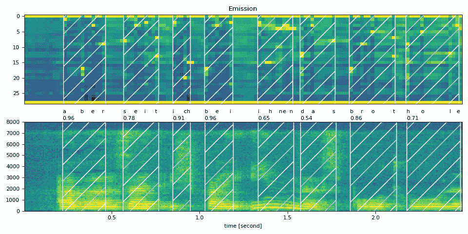
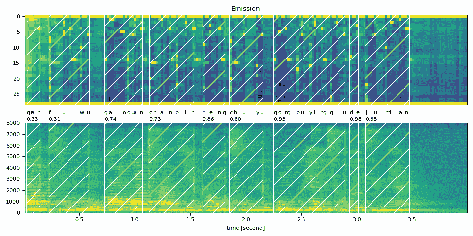
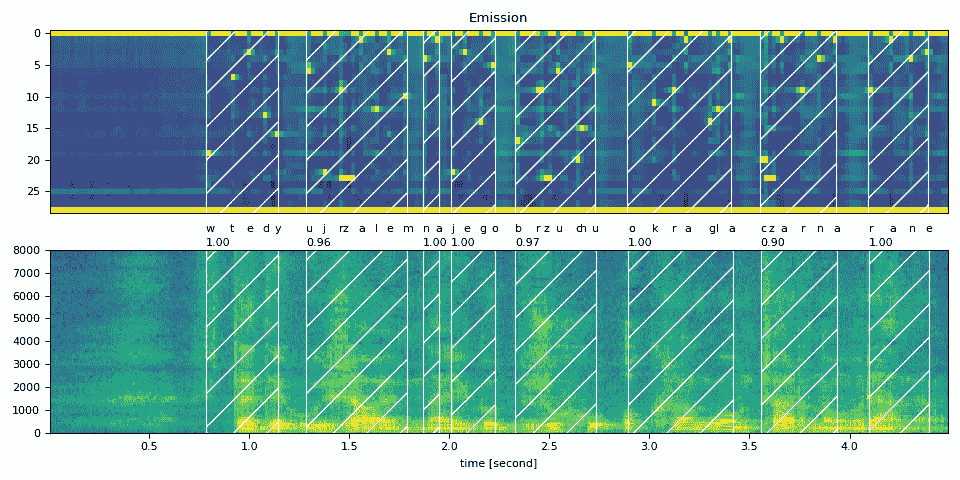
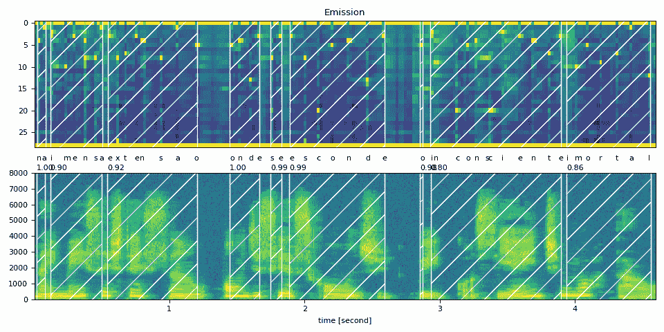
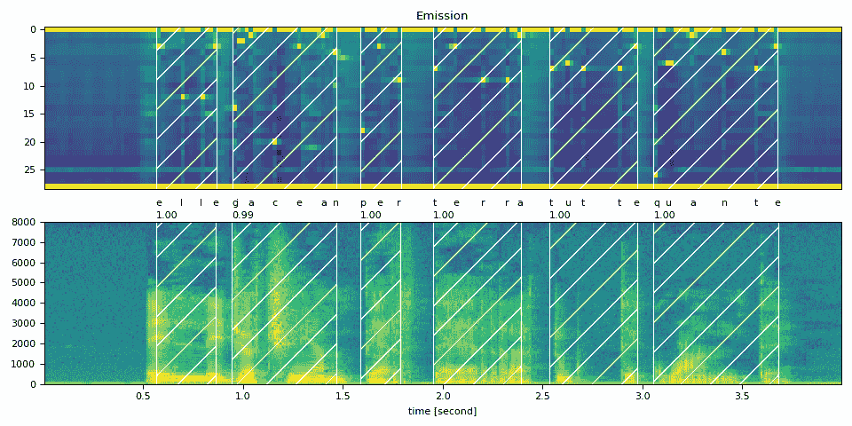

# 多语言数据的强制对齐

> 原文：[`pytorch.org/audio/stable/tutorials/forced_alignment_for_multilingual_data_tutorial.html`](https://pytorch.org/audio/stable/tutorials/forced_alignment_for_multilingual_data_tutorial.html)
>
> 译者：[飞龙](https://github.com/wizardforcel)
>
> 协议：[CC BY-NC-SA 4.0](http://creativecommons.org/licenses/by-nc-sa/4.0/)


注意

点击这里下载完整示例代码

**作者**：Xiaohui Zhang, Moto Hira。

本教程展示了如何为非英语语言对齐转录和语音。

对齐非英语（标准化）转录的过程与对齐英语（标准化）转录的过程相同，对于英语的过程在 CTC 强制对齐教程中有详细介绍。在本教程中，我们使用 TorchAudio 的高级 API，`torchaudio.pipelines.Wav2Vec2FABundle`，它打包了预训练模型、分词器和对齐器，以更少的代码执行强制对齐。

```py
import torch
import torchaudio

print(torch.__version__)
print([torchaudio.__version__](https://docs.python.org/3/library/stdtypes.html#str "builtins.str"))

[device](https://pytorch.org/docs/stable/tensor_attributes.html#torch.device "torch.device") = [torch.device](https://pytorch.org/docs/stable/tensor_attributes.html#torch.device "torch.device")("cuda" if [torch.cuda.is_available](https://pytorch.org/docs/stable/generated/torch.cuda.is_available.html#torch.cuda.is_available "torch.cuda.is_available")() else "cpu")
print([device](https://pytorch.org/docs/stable/tensor_attributes.html#torch.device "torch.device")) 
```

```py
2.2.0
2.2.0
cuda 
```

```py
from typing import [List](https://docs.python.org/3/library/typing.html#typing.List "typing.List")

import IPython
import matplotlib.pyplot as plt 
```

## 创建流程

首先，我们实例化模型和前/后处理流程。

以下图示了对齐的过程。


波形被传递给声学模型，该模型生成标记的概率分布序列。转录被传递给分词器，将转录转换为标记序列。对齐器获取声学模型和分词器的结果，并为每个标记生成时间戳。

注意

该过程期望输入的转录已经被标准化。标准化的过程涉及非英语语言的罗马化，是与语言相关的，因此本教程不涵盖，但我们将简要介绍。

声学模型和分词器必须使用相同的标记集。为了便于创建匹配的处理器，`Wav2Vec2FABundle`关联了一个预训练的声学模型和一个分词器。`torchaudio.pipelines.MMS_FA`就是这样一个实例。

以下代码实例化了一个预训练的声学模型，一个使用与模型相同的标记集的分词器，以及一个对齐器。

```py
from torchaudio.pipelines import MMS_FA as bundle

model = bundle.get_model()
[model.to](https://pytorch.org/docs/stable/generated/torch.nn.Module.html#torch.nn.Module.to "torch.nn.Module.to")([device](https://pytorch.org/docs/stable/tensor_attributes.html#torch.device "torch.device"))

tokenizer = bundle.get_tokenizer()
aligner = bundle.get_aligner() 
```

注意

通过`MMS_FA`的`get_model()`方法实例化的模型默认包含`<star>`标记的特征维度。您可以通过传递`with_star=False`来禁用此功能。

`MMS_FA`的声学模型是作为研究项目[将语音技术扩展到 1000 多种语言](https://research.facebook.com/publications/scaling-speech-technology-to-1000-languages/)的一部分创建并开源的。它使用来自 1100 多种语言的 23000 小时音频进行训练。

分词器简单地将标准化字符映射为整数。您可以按以下方式检查映射；

```py
print(bundle.get_dict()) 
```

```py
{'-': 0, 'a': 1, 'i': 2, 'e': 3, 'n': 4, 'o': 5, 'u': 6, 't': 7, 's': 8, 'r': 9, 'm': 10, 'k': 11, 'l': 12, 'd': 13, 'g': 14, 'h': 15, 'y': 16, 'b': 17, 'p': 18, 'w': 19, 'c': 20, 'v': 21, 'j': 22, 'z': 23, 'f': 24, "'": 25, 'q': 26, 'x': 27, '*': 28} 
```

对齐器内部使用`torchaudio.functional.forced_align()`和`torchaudio.functional.merge_tokens()`来推断输入标记的时间戳。

底层机制的详细信息在 CTC 强制对齐 API 教程中介绍，请参考。

我们定义了一个实用函数，使用上述模型、分词器和对齐器执行强制对齐。

```py
def compute_alignments([waveform](https://pytorch.org/docs/stable/tensors.html#torch.Tensor "torch.Tensor"): [torch.Tensor](https://pytorch.org/docs/stable/tensors.html#torch.Tensor "torch.Tensor"), [transcript](https://docs.python.org/3/library/stdtypes.html#list "builtins.list"): [List](https://docs.python.org/3/library/typing.html#typing.List "typing.List")[str]):
    with [torch.inference_mode](https://pytorch.org/docs/stable/generated/torch.inference_mode.html#torch.inference_mode "torch.inference_mode")():
        [emission](https://pytorch.org/docs/stable/tensors.html#torch.Tensor "torch.Tensor"), _ = model([waveform](https://pytorch.org/docs/stable/tensors.html#torch.Tensor "torch.Tensor").to([device](https://pytorch.org/docs/stable/tensor_attributes.html#torch.device "torch.device")))
        [token_spans](https://docs.python.org/3/library/stdtypes.html#list "builtins.list") = aligner([emission](https://pytorch.org/docs/stable/tensors.html#torch.Tensor "torch.Tensor")[0], tokenizer([transcript](https://docs.python.org/3/library/stdtypes.html#list "builtins.list")))
    return [emission](https://pytorch.org/docs/stable/tensors.html#torch.Tensor "torch.Tensor"), [token_spans](https://docs.python.org/3/library/stdtypes.html#list "builtins.list") 
```

我们还定义了用于绘制结果和预览音频片段的实用函数。

```py
# Compute average score weighted by the span length
def _score(spans):
    return sum(s.score * len(s) for s in spans) / sum(len(s) for s in spans)

def plot_alignments([waveform](https://pytorch.org/docs/stable/tensors.html#torch.Tensor "torch.Tensor"), [token_spans](https://docs.python.org/3/library/stdtypes.html#list "builtins.list"), [emission](https://pytorch.org/docs/stable/tensors.html#torch.Tensor "torch.Tensor"), [transcript](https://docs.python.org/3/library/stdtypes.html#list "builtins.list"), [sample_rate](https://docs.python.org/3/library/functions.html#int "builtins.int")=bundle.[sample_rate](https://docs.python.org/3/library/functions.html#int "builtins.int")):
    ratio = [waveform](https://pytorch.org/docs/stable/tensors.html#torch.Tensor "torch.Tensor").size(1) / [emission](https://pytorch.org/docs/stable/tensors.html#torch.Tensor "torch.Tensor").size(1) / [sample_rate](https://docs.python.org/3/library/functions.html#int "builtins.int")

    fig, axes = plt.subplots(2, 1)
    axes[0].imshow([emission](https://pytorch.org/docs/stable/tensors.html#torch.Tensor "torch.Tensor")[0].detach().cpu().T, aspect="auto")
    axes[0].set_title("Emission")
    axes[0].set_xticks([])

    axes[1].specgram([waveform](https://pytorch.org/docs/stable/tensors.html#torch.Tensor "torch.Tensor")[0], Fs=[sample_rate](https://docs.python.org/3/library/functions.html#int "builtins.int"))
    for t_spans, chars in zip([token_spans](https://docs.python.org/3/library/stdtypes.html#list "builtins.list"), [transcript](https://docs.python.org/3/library/stdtypes.html#list "builtins.list")):
        t0, t1 = t_spans[0].start, t_spans[-1].end
        axes[0].axvspan(t0 - 0.5, t1 - 0.5, facecolor="None", hatch="/", edgecolor="white")
        axes[1].axvspan(ratio * t0, ratio * t1, facecolor="None", hatch="/", edgecolor="white")
        axes[1].annotate(f"{_score(t_spans):.2f}", (ratio * t0, [sample_rate](https://docs.python.org/3/library/functions.html#int "builtins.int") * 0.51), annotation_clip=False)

        for span, char in zip(t_spans, chars):
            t0 = span.start * ratio
            axes[1].annotate(char, (t0, [sample_rate](https://docs.python.org/3/library/functions.html#int "builtins.int") * 0.55), annotation_clip=False)

    axes[1].set_xlabel("time [second]")
    fig.tight_layout() 
```

```py
def preview_word([waveform](https://pytorch.org/docs/stable/tensors.html#torch.Tensor "torch.Tensor"), spans, [num_frames](https://docs.python.org/3/library/functions.html#int "builtins.int"), [transcript](https://docs.python.org/3/library/stdtypes.html#list "builtins.list"), [sample_rate](https://docs.python.org/3/library/functions.html#int "builtins.int")=bundle.[sample_rate](https://docs.python.org/3/library/functions.html#int "builtins.int")):
    ratio = [waveform](https://pytorch.org/docs/stable/tensors.html#torch.Tensor "torch.Tensor").size(1) / [num_frames](https://docs.python.org/3/library/functions.html#int "builtins.int")
    x0 = int(ratio * spans[0].start)
    x1 = int(ratio * spans[-1].end)
    print(f"{[transcript](https://docs.python.org/3/library/stdtypes.html#list "builtins.list")} ({_score(spans):.2f}): {x0  /  [sample_rate](https://docs.python.org/3/library/functions.html#int "builtins.int"):.3f} - {x1  /  [sample_rate](https://docs.python.org/3/library/functions.html#int "builtins.int"):.3f} sec")
    segment = [waveform](https://pytorch.org/docs/stable/tensors.html#torch.Tensor "torch.Tensor")[:, x0:x1]
    return IPython.display.Audio(segment.numpy(), rate=[sample_rate](https://docs.python.org/3/library/functions.html#int "builtins.int")) 
```

## 将文本标准化

传递到流水线的文本必须事先进行标准化。标准化的确切过程取决于语言。

没有明确单词边界的语言（如中文、日文和韩文）需要首先进行分词。有专门的工具可以做到这一点，但假设我们已经对文本进行了分词。

标准化的第一步是罗马化。[uroman](https://github.com/isi-nlp/uroman)是一个支持多种语言的工具。

以下是一个 BASH 命令，用于罗马化输入文本文件并使用`uroman`将输出写入另一个文本文件。

```py
$  echo  "des événements d'actualité qui se sont produits durant l'année 1882"  >  text.txt
$  uroman/bin/uroman.pl  <  text.txt  >  text_romanized.txt
$  cat  text_romanized.txt 
```

```py
Cette page concerne des evenements d'actualite qui se sont produits durant l'annee 1882 
```

下一步是删除非字母和标点符号。以下代码段标准化了罗马化的文本。

```py
import re

def normalize_uroman(text):
    text = text.lower()
    text = text.replace("’", "'")
    text = re.sub("([^a-z' ])", " ", text)
    text = re.sub(' +', ' ', text)
    return text.strip()

with open("text_romanized.txt", "r") as f:
    for line in f:
        [text_normalized](https://docs.python.org/3/library/stdtypes.html#str "builtins.str") = normalize_uroman(line)
        print([text_normalized](https://docs.python.org/3/library/stdtypes.html#str "builtins.str")) 
```

在上述示例上运行脚本会产生以下结果。

```py
cette page concerne des evenements d'actualite qui se sont produits durant l'annee 
```

请注意，在此示例中，“1882”未被`uroman`罗马化，因此在标准化步骤中被移除。为了避免这种情况，需要罗马化数字，但这被认为是一个非常困难的任务。

## 将文本对齐到语音

现在我们为多种语言执行强制对齐。

### 德语

```py
[text_raw](https://docs.python.org/3/library/stdtypes.html#str "builtins.str") = "aber seit ich bei ihnen das brot hole"
[text_normalized](https://docs.python.org/3/library/stdtypes.html#str "builtins.str") = "aber seit ich bei ihnen das brot hole"

[url](https://docs.python.org/3/library/stdtypes.html#str "builtins.str") = "https://download.pytorch.org/torchaudio/tutorial-assets/10349_8674_000087.flac"
[waveform](https://pytorch.org/docs/stable/tensors.html#torch.Tensor "torch.Tensor"), [sample_rate](https://docs.python.org/3/library/functions.html#int "builtins.int") = torchaudio.load(
    [url](https://docs.python.org/3/library/stdtypes.html#str "builtins.str"), frame_offset=int(0.5 * bundle.[sample_rate](https://docs.python.org/3/library/functions.html#int "builtins.int")), [num_frames](https://docs.python.org/3/library/functions.html#int "builtins.int")=int(2.5 * bundle.[sample_rate](https://docs.python.org/3/library/functions.html#int "builtins.int"))
) 
```

```py
assert [sample_rate](https://docs.python.org/3/library/functions.html#int "builtins.int") == bundle.[sample_rate](https://docs.python.org/3/library/functions.html#int "builtins.int") 
```

```py
[transcript](https://docs.python.org/3/library/stdtypes.html#list "builtins.list") = [text_normalized](https://docs.python.org/3/library/stdtypes.html#str "builtins.str").split()
[tokens](https://docs.python.org/3/library/stdtypes.html#list "builtins.list") = tokenizer([transcript](https://docs.python.org/3/library/stdtypes.html#list "builtins.list"))

[emission](https://pytorch.org/docs/stable/tensors.html#torch.Tensor "torch.Tensor"), [token_spans](https://docs.python.org/3/library/stdtypes.html#list "builtins.list") = compute_alignments([waveform](https://pytorch.org/docs/stable/tensors.html#torch.Tensor "torch.Tensor"), [transcript](https://docs.python.org/3/library/stdtypes.html#list "builtins.list"))
[num_frames](https://docs.python.org/3/library/functions.html#int "builtins.int") = [emission](https://pytorch.org/docs/stable/tensors.html#torch.Tensor "torch.Tensor").size(1)

plot_alignments([waveform](https://pytorch.org/docs/stable/tensors.html#torch.Tensor "torch.Tensor"), [token_spans](https://docs.python.org/3/library/stdtypes.html#list "builtins.list"), [emission](https://pytorch.org/docs/stable/tensors.html#torch.Tensor "torch.Tensor"), [transcript](https://docs.python.org/3/library/stdtypes.html#list "builtins.list"))

print("Raw Transcript: ", [text_raw](https://docs.python.org/3/library/stdtypes.html#str "builtins.str"))
print("Normalized Transcript: ", [text_normalized](https://docs.python.org/3/library/stdtypes.html#str "builtins.str"))
IPython.display.Audio([waveform](https://pytorch.org/docs/stable/tensors.html#torch.Tensor "torch.Tensor"), rate=[sample_rate](https://docs.python.org/3/library/functions.html#int "builtins.int")) 
```



```py
Raw Transcript:  aber seit ich bei ihnen das brot hole
Normalized Transcript:  aber seit ich bei ihnen das brot hole 
```

您的浏览器不支持音频元素。

```py
preview_word([waveform](https://pytorch.org/docs/stable/tensors.html#torch.Tensor "torch.Tensor"), [token_spans](https://docs.python.org/3/library/stdtypes.html#list "builtins.list")[0], [num_frames](https://docs.python.org/3/library/functions.html#int "builtins.int"), [transcript](https://docs.python.org/3/library/stdtypes.html#list "builtins.list")[0]) 
```

```py
aber (0.96): 0.222 - 0.464 sec 
```

您的浏览器不支持音频元素。

```py
preview_word([waveform](https://pytorch.org/docs/stable/tensors.html#torch.Tensor "torch.Tensor"), [token_spans](https://docs.python.org/3/library/stdtypes.html#list "builtins.list")[1], [num_frames](https://docs.python.org/3/library/functions.html#int "builtins.int"), [transcript](https://docs.python.org/3/library/stdtypes.html#list "builtins.list")[1]) 
```

```py
seit (0.78): 0.565 - 0.766 sec 
```

您的浏览器不支持音频元素。

```py
preview_word([waveform](https://pytorch.org/docs/stable/tensors.html#torch.Tensor "torch.Tensor"), [token_spans](https://docs.python.org/3/library/stdtypes.html#list "builtins.list")[2], [num_frames](https://docs.python.org/3/library/functions.html#int "builtins.int"), [transcript](https://docs.python.org/3/library/stdtypes.html#list "builtins.list")[2]) 
```

```py
ich (0.91): 0.847 - 0.948 sec 
```

您的浏览器不支持音频元素。

```py
preview_word([waveform](https://pytorch.org/docs/stable/tensors.html#torch.Tensor "torch.Tensor"), [token_spans](https://docs.python.org/3/library/stdtypes.html#list "builtins.list")[3], [num_frames](https://docs.python.org/3/library/functions.html#int "builtins.int"), [transcript](https://docs.python.org/3/library/stdtypes.html#list "builtins.list")[3]) 
```

```py
bei (0.96): 1.028 - 1.190 sec 
```

您的浏览器不支持音频元素。

```py
preview_word([waveform](https://pytorch.org/docs/stable/tensors.html#torch.Tensor "torch.Tensor"), [token_spans](https://docs.python.org/3/library/stdtypes.html#list "builtins.list")[4], [num_frames](https://docs.python.org/3/library/functions.html#int "builtins.int"), [transcript](https://docs.python.org/3/library/stdtypes.html#list "builtins.list")[4]) 
```

```py
ihnen (0.65): 1.331 - 1.532 sec 
```

您的浏览器不支持音频元素。

```py
preview_word([waveform](https://pytorch.org/docs/stable/tensors.html#torch.Tensor "torch.Tensor"), [token_spans](https://docs.python.org/3/library/stdtypes.html#list "builtins.list")[5], [num_frames](https://docs.python.org/3/library/functions.html#int "builtins.int"), [transcript](https://docs.python.org/3/library/stdtypes.html#list "builtins.list")[5]) 
```

```py
das (0.54): 1.573 - 1.774 sec 
```

您的浏览器不支持音频元素。

```py
preview_word([waveform](https://pytorch.org/docs/stable/tensors.html#torch.Tensor "torch.Tensor"), [token_spans](https://docs.python.org/3/library/stdtypes.html#list "builtins.list")[6], [num_frames](https://docs.python.org/3/library/functions.html#int "builtins.int"), [transcript](https://docs.python.org/3/library/stdtypes.html#list "builtins.list")[6]) 
```

```py
brot (0.86): 1.855 - 2.117 sec 
```

您的浏览器不支持音频元素。

```py
preview_word([waveform](https://pytorch.org/docs/stable/tensors.html#torch.Tensor "torch.Tensor"), [token_spans](https://docs.python.org/3/library/stdtypes.html#list "builtins.list")[7], [num_frames](https://docs.python.org/3/library/functions.html#int "builtins.int"), [transcript](https://docs.python.org/3/library/stdtypes.html#list "builtins.list")[7]) 
```

```py
hole (0.71): 2.177 - 2.480 sec 
```

您的浏览器不支持音频元素。

### 中文

中文是一种基于字符的语言，在其原始书面形式中没有明确的单词级标记化（由空格分隔）。为了获得单词级别的对齐，您需要首先使用像[“斯坦福分词器”](https://michelleful.github.io/code-blog/2015/09/10/parsing-chinese-with-stanford/)这样的单词分词器对文本进行单词级别的标记化。但是，如果您只需要字符级别的对齐，则不需要这样做。

```py
[text_raw](https://docs.python.org/3/library/stdtypes.html#str "builtins.str") = "关 服务 高端 产品 仍 处于 供不应求 的 局面"
[text_normalized](https://docs.python.org/3/library/stdtypes.html#str "builtins.str") = "guan fuwu gaoduan chanpin reng chuyu gongbuyingqiu de jumian" 
```

```py
[url](https://docs.python.org/3/library/stdtypes.html#str "builtins.str") = "https://download.pytorch.org/torchaudio/tutorial-assets/mvdr/clean_speech.wav"
[waveform](https://pytorch.org/docs/stable/tensors.html#torch.Tensor "torch.Tensor"), [sample_rate](https://docs.python.org/3/library/functions.html#int "builtins.int") = torchaudio.load([url](https://docs.python.org/3/library/stdtypes.html#str "builtins.str"))
[waveform](https://pytorch.org/docs/stable/tensors.html#torch.Tensor "torch.Tensor") = [waveform](https://pytorch.org/docs/stable/tensors.html#torch.Tensor "torch.Tensor")[0:1] 
```

```py
assert [sample_rate](https://docs.python.org/3/library/functions.html#int "builtins.int") == bundle.[sample_rate](https://docs.python.org/3/library/functions.html#int "builtins.int") 
```

```py
[transcript](https://docs.python.org/3/library/stdtypes.html#list "builtins.list") = [text_normalized](https://docs.python.org/3/library/stdtypes.html#str "builtins.str").split()
[emission](https://pytorch.org/docs/stable/tensors.html#torch.Tensor "torch.Tensor"), [token_spans](https://docs.python.org/3/library/stdtypes.html#list "builtins.list") = compute_alignments([waveform](https://pytorch.org/docs/stable/tensors.html#torch.Tensor "torch.Tensor"), [transcript](https://docs.python.org/3/library/stdtypes.html#list "builtins.list"))
[num_frames](https://docs.python.org/3/library/functions.html#int "builtins.int") = [emission](https://pytorch.org/docs/stable/tensors.html#torch.Tensor "torch.Tensor").size(1)

plot_alignments([waveform](https://pytorch.org/docs/stable/tensors.html#torch.Tensor "torch.Tensor"), [token_spans](https://docs.python.org/3/library/stdtypes.html#list "builtins.list"), [emission](https://pytorch.org/docs/stable/tensors.html#torch.Tensor "torch.Tensor"), [transcript](https://docs.python.org/3/library/stdtypes.html#list "builtins.list"))

print("Raw Transcript: ", [text_raw](https://docs.python.org/3/library/stdtypes.html#str "builtins.str"))
print("Normalized Transcript: ", [text_normalized](https://docs.python.org/3/library/stdtypes.html#str "builtins.str"))
IPython.display.Audio([waveform](https://pytorch.org/docs/stable/tensors.html#torch.Tensor "torch.Tensor"), rate=[sample_rate](https://docs.python.org/3/library/functions.html#int "builtins.int")) 
```



```py
Raw Transcript:  关 服务 高端 产品 仍 处于 供不应求 的 局面
Normalized Transcript:  guan fuwu gaoduan chanpin reng chuyu gongbuyingqiu de jumian 
```

您的浏览器不支持音频元素。

```py
preview_word([waveform](https://pytorch.org/docs/stable/tensors.html#torch.Tensor "torch.Tensor"), [token_spans](https://docs.python.org/3/library/stdtypes.html#list "builtins.list")[0], [num_frames](https://docs.python.org/3/library/functions.html#int "builtins.int"), [transcript](https://docs.python.org/3/library/stdtypes.html#list "builtins.list")[0]) 
```

```py
guan (0.33): 0.020 - 0.141 sec 
```

您的浏览器不支持音频元素。

```py
preview_word([waveform](https://pytorch.org/docs/stable/tensors.html#torch.Tensor "torch.Tensor"), [token_spans](https://docs.python.org/3/library/stdtypes.html#list "builtins.list")[1], [num_frames](https://docs.python.org/3/library/functions.html#int "builtins.int"), [transcript](https://docs.python.org/3/library/stdtypes.html#list "builtins.list")[1]) 
```

```py
fuwu (0.31): 0.221 - 0.583 sec 
```

您的浏览器不支持音频元素。

```py
preview_word([waveform](https://pytorch.org/docs/stable/tensors.html#torch.Tensor "torch.Tensor"), [token_spans](https://docs.python.org/3/library/stdtypes.html#list "builtins.list")[2], [num_frames](https://docs.python.org/3/library/functions.html#int "builtins.int"), [transcript](https://docs.python.org/3/library/stdtypes.html#list "builtins.list")[2]) 
```

```py
gaoduan (0.74): 0.724 - 1.065 sec 
```

您的浏览器不支持音频元素。

```py
preview_word([waveform](https://pytorch.org/docs/stable/tensors.html#torch.Tensor "torch.Tensor"), [token_spans](https://docs.python.org/3/library/stdtypes.html#list "builtins.list")[3], [num_frames](https://docs.python.org/3/library/functions.html#int "builtins.int"), [transcript](https://docs.python.org/3/library/stdtypes.html#list "builtins.list")[3]) 
```

```py
chanpin (0.73): 1.126 - 1.528 sec 
```

您的浏览器不支持音频元素。

```py
preview_word([waveform](https://pytorch.org/docs/stable/tensors.html#torch.Tensor "torch.Tensor"), [token_spans](https://docs.python.org/3/library/stdtypes.html#list "builtins.list")[4], [num_frames](https://docs.python.org/3/library/functions.html#int "builtins.int"), [transcript](https://docs.python.org/3/library/stdtypes.html#list "builtins.list")[4]) 
```

```py
reng (0.86): 1.608 - 1.809 sec 
```

您的浏览器不支持音频元素。

```py
preview_word([waveform](https://pytorch.org/docs/stable/tensors.html#torch.Tensor "torch.Tensor"), [token_spans](https://docs.python.org/3/library/stdtypes.html#list "builtins.list")[5], [num_frames](https://docs.python.org/3/library/functions.html#int "builtins.int"), [transcript](https://docs.python.org/3/library/stdtypes.html#list "builtins.list")[5]) 
```

```py
chuyu (0.80): 1.849 - 2.151 sec 
```

您的浏览器不支持音频元素。

```py
preview_word([waveform](https://pytorch.org/docs/stable/tensors.html#torch.Tensor "torch.Tensor"), [token_spans](https://docs.python.org/3/library/stdtypes.html#list "builtins.list")[6], [num_frames](https://docs.python.org/3/library/functions.html#int "builtins.int"), [transcript](https://docs.python.org/3/library/stdtypes.html#list "builtins.list")[6]) 
```

```py
gongbuyingqiu (0.93): 2.251 - 2.894 sec 
```

您的浏览器不支持音频元素。

```py
preview_word([waveform](https://pytorch.org/docs/stable/tensors.html#torch.Tensor "torch.Tensor"), [token_spans](https://docs.python.org/3/library/stdtypes.html#list "builtins.list")[7], [num_frames](https://docs.python.org/3/library/functions.html#int "builtins.int"), [transcript](https://docs.python.org/3/library/stdtypes.html#list "builtins.list")[7]) 
```

```py
de (0.98): 2.935 - 3.015 sec 
```

您的浏览器不支持音频元素。

```py
preview_word([waveform](https://pytorch.org/docs/stable/tensors.html#torch.Tensor "torch.Tensor"), [token_spans](https://docs.python.org/3/library/stdtypes.html#list "builtins.list")[8], [num_frames](https://docs.python.org/3/library/functions.html#int "builtins.int"), [transcript](https://docs.python.org/3/library/stdtypes.html#list "builtins.list")[8]) 
```

```py
jumian (0.95): 3.075 - 3.477 sec 
```

您的浏览器不支持音频元素。

### 波兰语

```py
[text_raw](https://docs.python.org/3/library/stdtypes.html#str "builtins.str") = "wtedy ujrzałem na jego brzuchu okrągłą czarną ranę"
[text_normalized](https://docs.python.org/3/library/stdtypes.html#str "builtins.str") = "wtedy ujrzalem na jego brzuchu okragla czarna rane"

[url](https://docs.python.org/3/library/stdtypes.html#str "builtins.str") = "https://download.pytorch.org/torchaudio/tutorial-assets/5090_1447_000088.flac"
[waveform](https://pytorch.org/docs/stable/tensors.html#torch.Tensor "torch.Tensor"), [sample_rate](https://docs.python.org/3/library/functions.html#int "builtins.int") = torchaudio.load([url](https://docs.python.org/3/library/stdtypes.html#str "builtins.str"), [num_frames](https://docs.python.org/3/library/functions.html#int "builtins.int")=int(4.5 * bundle.[sample_rate](https://docs.python.org/3/library/functions.html#int "builtins.int"))) 
```

```py
assert [sample_rate](https://docs.python.org/3/library/functions.html#int "builtins.int") == bundle.[sample_rate](https://docs.python.org/3/library/functions.html#int "builtins.int") 
```

```py
[transcript](https://docs.python.org/3/library/stdtypes.html#list "builtins.list") = [text_normalized](https://docs.python.org/3/library/stdtypes.html#str "builtins.str").split()
[emission](https://pytorch.org/docs/stable/tensors.html#torch.Tensor "torch.Tensor"), [token_spans](https://docs.python.org/3/library/stdtypes.html#list "builtins.list") = compute_alignments([waveform](https://pytorch.org/docs/stable/tensors.html#torch.Tensor "torch.Tensor"), [transcript](https://docs.python.org/3/library/stdtypes.html#list "builtins.list"))
[num_frames](https://docs.python.org/3/library/functions.html#int "builtins.int") = [emission](https://pytorch.org/docs/stable/tensors.html#torch.Tensor "torch.Tensor").size(1)

plot_alignments([waveform](https://pytorch.org/docs/stable/tensors.html#torch.Tensor "torch.Tensor"), [token_spans](https://docs.python.org/3/library/stdtypes.html#list "builtins.list"), [emission](https://pytorch.org/docs/stable/tensors.html#torch.Tensor "torch.Tensor"), [transcript](https://docs.python.org/3/library/stdtypes.html#list "builtins.list"))

print("Raw Transcript: ", [text_raw](https://docs.python.org/3/library/stdtypes.html#str "builtins.str"))
print("Normalized Transcript: ", [text_normalized](https://docs.python.org/3/library/stdtypes.html#str "builtins.str"))
IPython.display.Audio([waveform](https://pytorch.org/docs/stable/tensors.html#torch.Tensor "torch.Tensor"), rate=[sample_rate](https://docs.python.org/3/library/functions.html#int "builtins.int")) 
```



```py
Raw Transcript:  wtedy ujrzałem na jego brzuchu okrągłą czarną ranę
Normalized Transcript:  wtedy ujrzalem na jego brzuchu okragla czarna rane 
```

您的浏览器不支持音频元素。

```py
preview_word([waveform](https://pytorch.org/docs/stable/tensors.html#torch.Tensor "torch.Tensor"), [token_spans](https://docs.python.org/3/library/stdtypes.html#list "builtins.list")[0], [num_frames](https://docs.python.org/3/library/functions.html#int "builtins.int"), [transcript](https://docs.python.org/3/library/stdtypes.html#list "builtins.list")[0]) 
```

```py
wtedy (1.00): 0.783 - 1.145 sec 
```

您的浏览器不支持音频元素。

```py
preview_word([waveform](https://pytorch.org/docs/stable/tensors.html#torch.Tensor "torch.Tensor"), [token_spans](https://docs.python.org/3/library/stdtypes.html#list "builtins.list")[1], [num_frames](https://docs.python.org/3/library/functions.html#int "builtins.int"), [transcript](https://docs.python.org/3/library/stdtypes.html#list "builtins.list")[1]) 
```

```py
ujrzalem (0.96): 1.286 - 1.788 sec 
```

您的浏览器不支持音频元素。

```py
preview_word([waveform](https://pytorch.org/docs/stable/tensors.html#torch.Tensor "torch.Tensor"), [token_spans](https://docs.python.org/3/library/stdtypes.html#list "builtins.list")[2], [num_frames](https://docs.python.org/3/library/functions.html#int "builtins.int"), [transcript](https://docs.python.org/3/library/stdtypes.html#list "builtins.list")[2]) 
```

```py
na (1.00): 1.868 - 1.949 sec 
```

您的浏览器不支持音频元素。

```py
preview_word([waveform](https://pytorch.org/docs/stable/tensors.html#torch.Tensor "torch.Tensor"), [token_spans](https://docs.python.org/3/library/stdtypes.html#list "builtins.list")[3], [num_frames](https://docs.python.org/3/library/functions.html#int "builtins.int"), [transcript](https://docs.python.org/3/library/stdtypes.html#list "builtins.list")[3]) 
```

```py
jego (1.00): 2.009 - 2.230 sec 
```

您的浏览器不支持音频元素。

```py
preview_word([waveform](https://pytorch.org/docs/stable/tensors.html#torch.Tensor "torch.Tensor"), [token_spans](https://docs.python.org/3/library/stdtypes.html#list "builtins.list")[4], [num_frames](https://docs.python.org/3/library/functions.html#int "builtins.int"), [transcript](https://docs.python.org/3/library/stdtypes.html#list "builtins.list")[4]) 
```

```py
brzuchu (0.97): 2.330 - 2.732 sec 
```

您的浏览器不支持音频元素。

```py
preview_word([waveform](https://pytorch.org/docs/stable/tensors.html#torch.Tensor "torch.Tensor"), [token_spans](https://docs.python.org/3/library/stdtypes.html#list "builtins.list")[5], [num_frames](https://docs.python.org/3/library/functions.html#int "builtins.int"), [transcript](https://docs.python.org/3/library/stdtypes.html#list "builtins.list")[5]) 
```

```py
okragla (1.00): 2.893 - 3.415 sec 
```

您的浏览器不支持音频元素。

```py
preview_word([waveform](https://pytorch.org/docs/stable/tensors.html#torch.Tensor "torch.Tensor"), [token_spans](https://docs.python.org/3/library/stdtypes.html#list "builtins.list")[6], [num_frames](https://docs.python.org/3/library/functions.html#int "builtins.int"), [transcript](https://docs.python.org/3/library/stdtypes.html#list "builtins.list")[6]) 
```

```py
czarna (0.90): 3.556 - 3.938 sec 
```

您的浏览器不支持音频元素。

```py
preview_word([waveform](https://pytorch.org/docs/stable/tensors.html#torch.Tensor "torch.Tensor"), [token_spans](https://docs.python.org/3/library/stdtypes.html#list "builtins.list")[7], [num_frames](https://docs.python.org/3/library/functions.html#int "builtins.int"), [transcript](https://docs.python.org/3/library/stdtypes.html#list "builtins.list")[7]) 
```

```py
rane (1.00): 4.098 - 4.399 sec 
```

您的浏览器不支持音频元素。

### 葡萄牙语

```py
[text_raw](https://docs.python.org/3/library/stdtypes.html#str "builtins.str") = "na imensa extensão onde se esconde o inconsciente imortal"
[text_normalized](https://docs.python.org/3/library/stdtypes.html#str "builtins.str") = "na imensa extensao onde se esconde o inconsciente imortal"

[url](https://docs.python.org/3/library/stdtypes.html#str "builtins.str") = "https://download.pytorch.org/torchaudio/tutorial-assets/6566_5323_000027.flac"
[waveform](https://pytorch.org/docs/stable/tensors.html#torch.Tensor "torch.Tensor"), [sample_rate](https://docs.python.org/3/library/functions.html#int "builtins.int") = torchaudio.load(
    [url](https://docs.python.org/3/library/stdtypes.html#str "builtins.str"), frame_offset=int(bundle.[sample_rate](https://docs.python.org/3/library/functions.html#int "builtins.int")), [num_frames](https://docs.python.org/3/library/functions.html#int "builtins.int")=int(4.6 * bundle.[sample_rate](https://docs.python.org/3/library/functions.html#int "builtins.int"))
) 
```

```py
assert [sample_rate](https://docs.python.org/3/library/functions.html#int "builtins.int") == bundle.[sample_rate](https://docs.python.org/3/library/functions.html#int "builtins.int") 
```

```py
[transcript](https://docs.python.org/3/library/stdtypes.html#list "builtins.list") = [text_normalized](https://docs.python.org/3/library/stdtypes.html#str "builtins.str").split()
[emission](https://pytorch.org/docs/stable/tensors.html#torch.Tensor "torch.Tensor"), [token_spans](https://docs.python.org/3/library/stdtypes.html#list "builtins.list") = compute_alignments([waveform](https://pytorch.org/docs/stable/tensors.html#torch.Tensor "torch.Tensor"), [transcript](https://docs.python.org/3/library/stdtypes.html#list "builtins.list"))
[num_frames](https://docs.python.org/3/library/functions.html#int "builtins.int") = [emission](https://pytorch.org/docs/stable/tensors.html#torch.Tensor "torch.Tensor").size(1)

plot_alignments([waveform](https://pytorch.org/docs/stable/tensors.html#torch.Tensor "torch.Tensor"), [token_spans](https://docs.python.org/3/library/stdtypes.html#list "builtins.list"), [emission](https://pytorch.org/docs/stable/tensors.html#torch.Tensor "torch.Tensor"), [transcript](https://docs.python.org/3/library/stdtypes.html#list "builtins.list"))

print("Raw Transcript: ", [text_raw](https://docs.python.org/3/library/stdtypes.html#str "builtins.str"))
print("Normalized Transcript: ", [text_normalized](https://docs.python.org/3/library/stdtypes.html#str "builtins.str"))
IPython.display.Audio([waveform](https://pytorch.org/docs/stable/tensors.html#torch.Tensor "torch.Tensor"), rate=[sample_rate](https://docs.python.org/3/library/functions.html#int "builtins.int")) 
```



```py
Raw Transcript:  na imensa extensão onde se esconde o inconsciente imortal
Normalized Transcript:  na imensa extensao onde se esconde o inconsciente imortal 
```

您的浏览器不支持音频元素。

```py
preview_word([waveform](https://pytorch.org/docs/stable/tensors.html#torch.Tensor "torch.Tensor"), [token_spans](https://docs.python.org/3/library/stdtypes.html#list "builtins.list")[0], [num_frames](https://docs.python.org/3/library/functions.html#int "builtins.int"), [transcript](https://docs.python.org/3/library/stdtypes.html#list "builtins.list")[0]) 
```

```py
na (1.00): 0.020 - 0.080 sec 
```

您的浏览器不支持音频元素。

```py
preview_word([waveform](https://pytorch.org/docs/stable/tensors.html#torch.Tensor "torch.Tensor"), [token_spans](https://docs.python.org/3/library/stdtypes.html#list "builtins.list")[1], [num_frames](https://docs.python.org/3/library/functions.html#int "builtins.int"), [transcript](https://docs.python.org/3/library/stdtypes.html#list "builtins.list")[1]) 
```

```py
imensa (0.90): 0.120 - 0.502 sec 
```

您的浏览器不支持音频元素。

```py
preview_word([waveform](https://pytorch.org/docs/stable/tensors.html#torch.Tensor "torch.Tensor"), [token_spans](https://docs.python.org/3/library/stdtypes.html#list "builtins.list")[2], [num_frames](https://docs.python.org/3/library/functions.html#int "builtins.int"), [transcript](https://docs.python.org/3/library/stdtypes.html#list "builtins.list")[2]) 
```

```py
extensao (0.92): 0.542 - 1.205 sec 
```

您的浏览器不支持音频元素。

```py
preview_word([waveform](https://pytorch.org/docs/stable/tensors.html#torch.Tensor "torch.Tensor"), [token_spans](https://docs.python.org/3/library/stdtypes.html#list "builtins.list")[3], [num_frames](https://docs.python.org/3/library/functions.html#int "builtins.int"), [transcript](https://docs.python.org/3/library/stdtypes.html#list "builtins.list")[3]) 
```

```py
onde (1.00): 1.446 - 1.667 sec 
```

您的浏览器不支持音频元素。

```py
preview_word([waveform](https://pytorch.org/docs/stable/tensors.html#torch.Tensor "torch.Tensor"), [token_spans](https://docs.python.org/3/library/stdtypes.html#list "builtins.list")[4], [num_frames](https://docs.python.org/3/library/functions.html#int "builtins.int"), [transcript](https://docs.python.org/3/library/stdtypes.html#list "builtins.list")[4]) 
```

```py
se (0.99): 1.748 - 1.828 sec 
```

您的浏览器不支持音频元素。

```py
preview_word([waveform](https://pytorch.org/docs/stable/tensors.html#torch.Tensor "torch.Tensor"), [token_spans](https://docs.python.org/3/library/stdtypes.html#list "builtins.list")[5], [num_frames](https://docs.python.org/3/library/functions.html#int "builtins.int"), [transcript](https://docs.python.org/3/library/stdtypes.html#list "builtins.list")[5]) 
```

```py
esconde (0.99): 1.888 - 2.591 sec 
```

您的浏览器不支持音频元素。

```py
preview_word([waveform](https://pytorch.org/docs/stable/tensors.html#torch.Tensor "torch.Tensor"), [token_spans](https://docs.python.org/3/library/stdtypes.html#list "builtins.list")[6], [num_frames](https://docs.python.org/3/library/functions.html#int "builtins.int"), [transcript](https://docs.python.org/3/library/stdtypes.html#list "builtins.list")[6]) 
```

```py
o (0.98): 2.852 - 2.872 sec 
```

您的浏览器不支持音频元素。

```py
preview_word([waveform](https://pytorch.org/docs/stable/tensors.html#torch.Tensor "torch.Tensor"), [token_spans](https://docs.python.org/3/library/stdtypes.html#list "builtins.list")[7], [num_frames](https://docs.python.org/3/library/functions.html#int "builtins.int"), [transcript](https://docs.python.org/3/library/stdtypes.html#list "builtins.list")[7]) 
```

```py
inconsciente (0.80): 2.933 - 3.897 sec 
```

您的浏览器不支持音频元素。

```py
preview_word([waveform](https://pytorch.org/docs/stable/tensors.html#torch.Tensor "torch.Tensor"), [token_spans](https://docs.python.org/3/library/stdtypes.html#list "builtins.list")[8], [num_frames](https://docs.python.org/3/library/functions.html#int "builtins.int"), [transcript](https://docs.python.org/3/library/stdtypes.html#list "builtins.list")[8]) 
```

```py
imortal (0.86): 3.937 - 4.560 sec 
```

您的浏览器不支持音频元素。

### 意大利语

```py
[text_raw](https://docs.python.org/3/library/stdtypes.html#str "builtins.str") = "elle giacean per terra tutte quante"
[text_normalized](https://docs.python.org/3/library/stdtypes.html#str "builtins.str") = "elle giacean per terra tutte quante"

[url](https://docs.python.org/3/library/stdtypes.html#str "builtins.str") = "https://download.pytorch.org/torchaudio/tutorial-assets/642_529_000025.flac"
[waveform](https://pytorch.org/docs/stable/tensors.html#torch.Tensor "torch.Tensor"), [sample_rate](https://docs.python.org/3/library/functions.html#int "builtins.int") = torchaudio.load([url](https://docs.python.org/3/library/stdtypes.html#str "builtins.str"), [num_frames](https://docs.python.org/3/library/functions.html#int "builtins.int")=int(4 * bundle.[sample_rate](https://docs.python.org/3/library/functions.html#int "builtins.int"))) 
```

```py
assert [sample_rate](https://docs.python.org/3/library/functions.html#int "builtins.int") == bundle.[sample_rate](https://docs.python.org/3/library/functions.html#int "builtins.int") 
```

```py
[transcript](https://docs.python.org/3/library/stdtypes.html#list "builtins.list") = [text_normalized](https://docs.python.org/3/library/stdtypes.html#str "builtins.str").split()
[emission](https://pytorch.org/docs/stable/tensors.html#torch.Tensor "torch.Tensor"), [token_spans](https://docs.python.org/3/library/stdtypes.html#list "builtins.list") = compute_alignments([waveform](https://pytorch.org/docs/stable/tensors.html#torch.Tensor "torch.Tensor"), [transcript](https://docs.python.org/3/library/stdtypes.html#list "builtins.list"))
[num_frames](https://docs.python.org/3/library/functions.html#int "builtins.int") = [emission](https://pytorch.org/docs/stable/tensors.html#torch.Tensor "torch.Tensor").size(1)

plot_alignments([waveform](https://pytorch.org/docs/stable/tensors.html#torch.Tensor "torch.Tensor"), [token_spans](https://docs.python.org/3/library/stdtypes.html#list "builtins.list"), [emission](https://pytorch.org/docs/stable/tensors.html#torch.Tensor "torch.Tensor"), [transcript](https://docs.python.org/3/library/stdtypes.html#list "builtins.list"))

print("Raw Transcript: ", [text_raw](https://docs.python.org/3/library/stdtypes.html#str "builtins.str"))
print("Normalized Transcript: ", [text_normalized](https://docs.python.org/3/library/stdtypes.html#str "builtins.str"))
IPython.display.Audio([waveform](https://pytorch.org/docs/stable/tensors.html#torch.Tensor "torch.Tensor"), rate=[sample_rate](https://docs.python.org/3/library/functions.html#int "builtins.int")) 
```



```py
Raw Transcript:  elle giacean per terra tutte quante
Normalized Transcript:  elle giacean per terra tutte quante 
```

您的浏览器不支持音频元素。

```py
preview_word([waveform](https://pytorch.org/docs/stable/tensors.html#torch.Tensor "torch.Tensor"), [token_spans](https://docs.python.org/3/library/stdtypes.html#list "builtins.list")[0], [num_frames](https://docs.python.org/3/library/functions.html#int "builtins.int"), [transcript](https://docs.python.org/3/library/stdtypes.html#list "builtins.list")[0]) 
```

```py
elle (1.00): 0.563 - 0.864 sec 
```

您的浏览器不支持音频元素。

```py
preview_word([waveform](https://pytorch.org/docs/stable/tensors.html#torch.Tensor "torch.Tensor"), [token_spans](https://docs.python.org/3/library/stdtypes.html#list "builtins.list")[1], [num_frames](https://docs.python.org/3/library/functions.html#int "builtins.int"), [transcript](https://docs.python.org/3/library/stdtypes.html#list "builtins.list")[1]) 
```

```py
giacean (0.99): 0.945 - 1.467 sec 
```

您的浏览器不支持音频元素。

```py
preview_word([waveform](https://pytorch.org/docs/stable/tensors.html#torch.Tensor "torch.Tensor"), [token_spans](https://docs.python.org/3/library/stdtypes.html#list "builtins.list")[2], [num_frames](https://docs.python.org/3/library/functions.html#int "builtins.int"), [transcript](https://docs.python.org/3/library/stdtypes.html#list "builtins.list")[2]) 
```

```py
per (1.00): 1.588 - 1.789 sec 
```

您的浏览器不支持音频元素。

```py
preview_word([waveform](https://pytorch.org/docs/stable/tensors.html#torch.Tensor "torch.Tensor"), [token_spans](https://docs.python.org/3/library/stdtypes.html#list "builtins.list")[3], [num_frames](https://docs.python.org/3/library/functions.html#int "builtins.int"), [transcript](https://docs.python.org/3/library/stdtypes.html#list "builtins.list")[3]) 
```

```py
terra (1.00): 1.950 - 2.392 sec 
```

您的浏览器不支持音频元素。

```py
preview_word([waveform](https://pytorch.org/docs/stable/tensors.html#torch.Tensor "torch.Tensor"), [token_spans](https://docs.python.org/3/library/stdtypes.html#list "builtins.list")[4], [num_frames](https://docs.python.org/3/library/functions.html#int "builtins.int"), [transcript](https://docs.python.org/3/library/stdtypes.html#list "builtins.list")[4]) 
```

```py
tutte (1.00): 2.533 - 2.975 sec 
```

您的浏览器不支持音频元素。

```py
preview_word([waveform](https://pytorch.org/docs/stable/tensors.html#torch.Tensor "torch.Tensor"), [token_spans](https://docs.python.org/3/library/stdtypes.html#list "builtins.list")[5], [num_frames](https://docs.python.org/3/library/functions.html#int "builtins.int"), [transcript](https://docs.python.org/3/library/stdtypes.html#list "builtins.list")[5]) 
```

```py
quante (1.00): 3.055 - 3.678 sec 
```

您的浏览器不支持音频元素。

## 结论

在本教程中，我们看了如何使用 torchaudio 的强制对齐 API 和一个 Wav2Vec2 预训练的多语言声学模型来将五种语言的语音数据与文本对齐。

## 致谢

感谢 Vineel Pratap 和 Zhaoheng Ni 开发并开源了强制对齐器 API。

**脚本的总运行时间：**（0 分钟 4.115 秒）

`下载 Python 源代码：forced_alignment_for_multilingual_data_tutorial.py`

`下载 Jupyter 笔记本：forced_alignment_for_multilingual_data_tutorial.ipynb`

[Sphinx-Gallery 生成的图库](https://sphinx-gallery.github.io)
