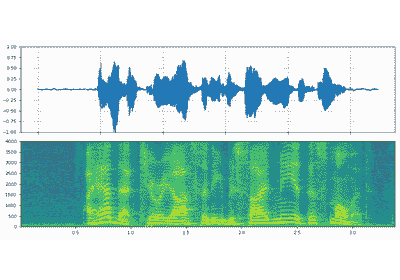
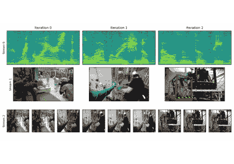
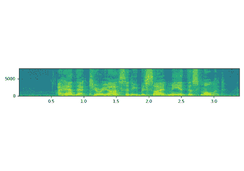
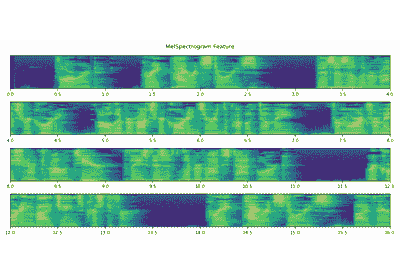
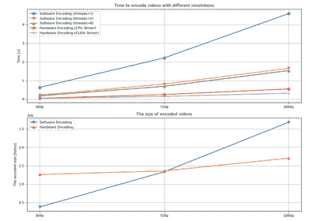
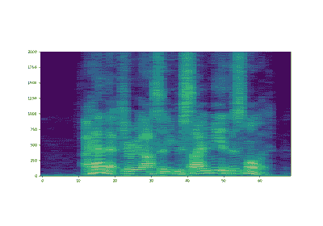
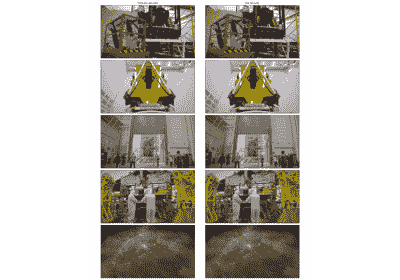

# torio.io

> 原文：[`pytorch.org/audio/stable/torio.io.html`](https://pytorch.org/audio/stable/torio.io.html)
>
> 译者：[飞龙](https://github.com/wizardforcel)
>
> 协议：[CC BY-NC-SA 4.0](http://creativecommons.org/licenses/by-nc-sa/4.0/)

| `StreamingMediaDecoder` | 逐块获取和解码音频/视频流。 |
| --- | --- |
| `StreamingMediaEncoder` | 逐块编码和写入音频/视频流 |

使用`torio.io`的教程

StreamWriter 高级用法

StreamWriter 高级用法

StreamReader 高级用法

StreamReader 高级用法

StreamReader 基本用法

StreamReader 基本用法

AudioEffector 用法

AudioEffector 用法

使用 Emformer RNN-T 进行在线 ASR

使用 Emformer RNN-T 进行在线 ASR

使用 Emformer RNN-T 进行设备 ASR

使用 Emformer RNN-T 进行设备 ASR

NVENC 加速视频编码

NVENC 加速视频编码

StreamWriter 基本用法

StreamWriter 基本用法

使用 Emformer RNN-T 进行设备 AV-ASR

使用 Emformer RNN-T 进行设备 AV-ASR

NVDEC 加速视频解码

NVDEC 加速视频解码
