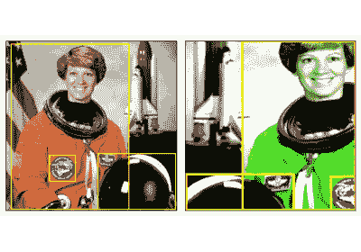
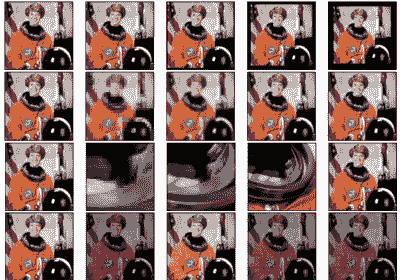
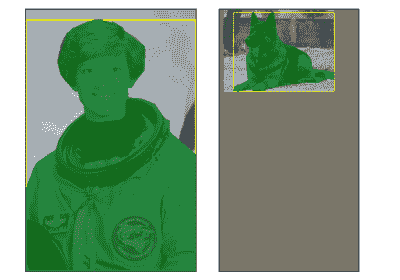
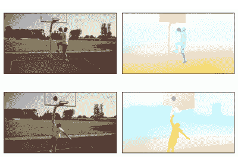
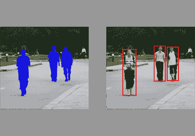
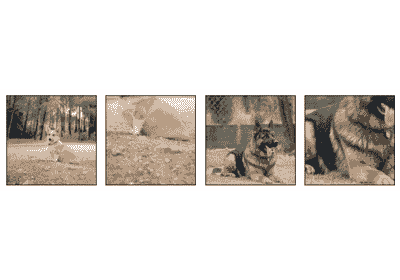
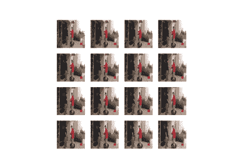
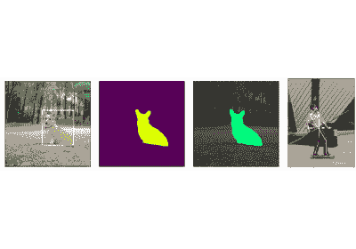

# 示例和教程

> 原文：[`pytorch.org/vision/stable/auto_examples/index.html`](https://pytorch.org/vision/stable/auto_examples/index.html)
>
> 译者：[飞龙](https://github.com/wizardforcel)
>
> 协议：[CC BY-NC-SA 4.0](http://creativecommons.org/licenses/by-nc-sa/4.0/)

## 变换

开始使用变换 v2

开始使用变换 v2

变换的示例

变换的示例

变换 v2：端到端目标检测/分割示例

变换 v2：端到端目标检测/分割示例

如何使用 CutMix 和 MixUp

如何使用 CutMix 和 MixUp

如何编写自己的 v2 变换

如何编写自己的 v2 变换

TVTensors 常见问题

TVTensors 常见问题

如何编写自己的 TVTensor 类

如何编写自己的 TVTensor 类

## 其他

光流：使用 RAFT 模型预测运动

光流：使用 RAFT 模型预测运动

将掩模重新用于边界框

将掩模重新用于边界框

Torchscript 支持

Torchscript 支持

视频 API

视频 API

可视化工具

可视化工具

`下载所有 Python 源代码示例：auto_examples_python.zip`

`下载所有 Jupyter 笔记本示例：auto_examples_jupyter.zip`

[Sphinx-Gallery 生成的画廊](https://sphinx-gallery.github.io)
